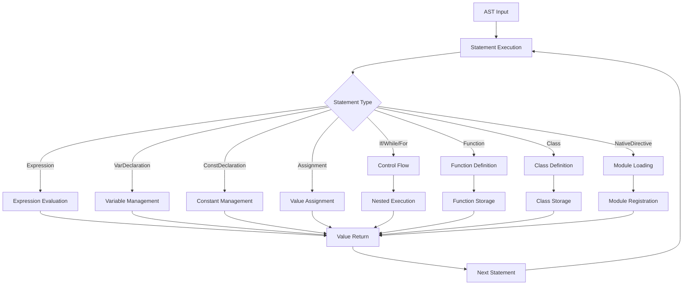

# 🚀 Manual Técnico do Runtime Dryad

**Versão:** 1.0  
**Data:** 3 de outubro de 2025  
**Público-alvo:** Desenvolvedores de Runtime, Contribuidores Avançados  
**Status:** Documentação Técnica Completa  

---

## 📋 Índice

1. [Arquitetura Geral do Runtime](#-arquitetura-geral-do-runtime)
2. [Pipeline de Execução](#-pipeline-de-execução)
3. [Sistema de Valores (Value System)](#-sistema-de-valores-value-system)
4. [Interpretador Core](#-interpretador-core)
5. [Gestão de Memória](#-gestão-de-memória)
6. [Sistema de Escopo e Variáveis](#-sistema-de-escopo-e-variáveis)
7. [Sistema de Constantes](#-sistema-de-constantes)
8. [Fluxo de Controle](#-fluxo-de-controle)
9. [Sistema de Módulos Nativos](#-sistema-de-módulos-nativos)
10. [Sistema de Classes e Objetos](#-sistema-de-classes-e-objetos)
11. [Processamento Assíncrono](#-processamento-assíncrono)
12. [Tratamento de Erros](#-tratamento-de-erros)
13. [Otimizações de Performance](#-otimizações-de-performance)
14. [Debugging e Profiling](#-debugging-e-profiling)
15. [Extensibilidade](#-extensibilidade)
16. [Padrões de Implementação](#-padrões-de-implementação)

---

## 🏗 Arquitetura Geral do Runtime

### Visão Geral

O runtime Dryad é um interpretador baseado em árvore (tree-walking interpreter) implementado em Rust, que executa diretamente a AST (Abstract Syntax Tree) gerada pelo parser. Esta abordagem prioriza simplicidade de implementação e facilidade de debugging sobre performance pura.

```rust
┌─────────────────────────────────────────────────────────────┐
│                    RUNTIME DRYAD                           │
├─────────────────────────────────────────────────────────────┤
│                 INTERPRETER CORE                           │
│  ┌─────────────┐  ┌─────────────┐  ┌─────────────┐         │
│  │   VALUE     │  │   SCOPE     │  │ FLOW CONTROL│         │
│  │   SYSTEM    │  │ MANAGEMENT  │  │   SYSTEM    │         │
│  └─────────────┘  └─────────────┘  └─────────────┘         │
├─────────────────────────────────────────────────────────────┤
│              MÓDULOS NATIVOS                               │
│  ┌─────────────┐  ┌─────────────┐  ┌─────────────┐         │
│  │  CONSOLE    │  │   FILE I/O  │  │   NETWORK   │         │
│  │     I/O     │  │   CRYPTO    │  │   HTTP/TCP  │         │
│  └─────────────┘  └─────────────┘  └─────────────┘         │
├─────────────────────────────────────────────────────────────┤
│              GERENCIAMENTO DE ESTADO                      │
│  ┌─────────────┐  ┌─────────────┐  ┌─────────────┐         │
│  │ VARIABLES   │  │ CONSTANTS   │  │   CLASSES   │         │
│  │   SCOPE     │  │ PROTECTION  │  │ INSTANCES   │         │
│  └─────────────┘  └─────────────┘  └─────────────┘         │
└─────────────────────────────────────────────────────────────┘
```

### Características Arquiteturais

- **Thread Safety**: Runtime single-threaded com suporte limitado a operações assíncronas
- **Memory Model**: Gestão automática com clone-on-write para valores compostos
- **Error Handling**: Sistema unificado de propagação de erros via `DryadError`
- **Modularidade**: Sistema plugável de módulos nativos
- **Extensibilidade**: Interface clara para adição de novas funcionalidades

---

## 🔄 Pipeline de Execução

### Fluxo Principal



### Implementação do Loop Principal

```rust
impl Interpreter {
    pub fn execute(&mut self, program: &Program) -> Result<String, DryadError> {
        let mut last_value = Value::Null;
        
        for statement in &program.statements {
            match self.execute_statement(statement)? {
                Some(value) => last_value = value,
                None => {} // Statements que não retornam valor
            }
        }
        
        Ok(last_value.to_string())
    }
}
```

### Processamento de Statements

O método `execute_statement` é o dispatcher central que roteie cada tipo de statement para seu processador específico:

```rust
fn execute_statement(&mut self, stmt: &Stmt) -> Result<Option<Value>, DryadError> {
    match stmt {
        Stmt::Expression(expr) => Ok(Some(self.evaluate(expr)?)),
        Stmt::VarDeclaration(name, init) => self.handle_var_declaration(name, init),
        Stmt::ConstDeclaration(name, expr) => self.handle_const_declaration(name, expr),
        Stmt::Assignment(name, expr) => self.handle_assignment(name, expr),
        // ... outros tipos
    }
}
```

---

## 💎 Sistema de Valores (Value System)

### Enum Value

O sistema de valores é implementado através do enum `Value`, que representa todos os tipos possíveis em Dryad:

```rust
#[derive(Debug, Clone)]
pub enum Value {
    // Tipos primitivos
    Number(f64),
    String(String),
    Bool(bool),
    Null,
    
    // Tipos compostos
    Array(Vec<Value>),
    Tuple(Vec<Value>),
    
    // Tipos funcionais
    Function {
        name: String,
        params: Vec<String>,
        body: Stmt,
    },
    Lambda {
        params: Vec<String>,
        body: Box<Expr>,
        closure: HashMap<String, Value>, // Captura de escopo
    },
    
    // Tipos de classe
    Class {
        name: String,
        parent: Option<String>,
        methods: HashMap<String, ClassMethod>,
        properties: HashMap<String, ClassProperty>,
    },
    Instance {
        class_name: String,
        properties: HashMap<String, Value>,
    },
    
    // Tipos especiais
    Exception(String),
    Thread { id: u64, is_running: bool },
    Mutex { id: u64, locked: bool },
    Promise { id: u64, resolved: bool, value: Option<Box<Value>> },
}
```

### Características do Sistema de Valores

#### 1. **Type Coercion**
```rust
impl Value {
    pub fn is_truthy(&self) -> bool {
        match self {
            Value::Bool(b) => *b,
            Value::Number(n) => *n != 0.0,
            Value::String(s) => !s.is_empty(),
            Value::Null => false,
            _ => true, // Arrays, objetos, etc. são sempre truthy
        }
    }
}
```

#### 2. **String Conversion**
```rust
impl Value {
    pub fn to_string(&self) -> String {
        match self {
            Value::Number(n) => {
                if n.fract() == 0.0 {
                    format!("{}", *n as i64) // Remove .0 de inteiros
                } else {
                    format!("{}", n)
                }
            },
            Value::String(s) => s.clone(),
            Value::Bool(b) => b.to_string(),
            Value::Null => "null".to_string(),
            Value::Array(arr) => {
                let items: Vec<String> = arr.iter()
                    .map(|v| v.to_string())
                    .collect();
                format!("[{}]", items.join(", "))
            },
            // ... outros tipos
        }
    }
}
```

#### 3. **Memory Layout**
- **Primitivos**: Armazenados diretamente no enum (stack allocation)
- **Strings**: `String` do Rust (heap allocation com referência contada)
- **Arrays/Tuples**: `Vec<Value>` (heap allocation)
- **Closures**: `HashMap<String, Value>` para captura de escopo

---

## 🧠 Interpretador Core

### Estrutura do Interpretador

```rust
pub struct Interpreter {
    // Estado principal
    variables: HashMap<String, Value>,
    constants: HashMap<String, Value>,
    
    // Sistema de classes
    classes: HashMap<String, Value>,
    current_instance: Option<Value>, // Contexto 'this'
    
    // Módulos nativos
    native_modules: NativeModuleManager,
    imported_modules: HashMap<String, HashMap<String, Value>>,
    
    // Sistema de arquivos
    current_file_path: Option<PathBuf>,
    
    // Concorrência (experimental)
    next_thread_id: u64,
    next_mutex_id: u64,
    next_promise_id: u64,
    threads: HashMap<u64, std::thread::JoinHandle<Result<Value, DryadError>>>,
    mutexes: HashMap<u64, std::sync::Arc<std::sync::Mutex<()>>>,
    promises: HashMap<u64, tokio::task::JoinHandle<Result<Value, DryadError>>>,
}
```

### Avaliação de Expressões

O core da execução está no método `evaluate` que processa expressões:

```rust
fn evaluate(&mut self, expr: &Expr) -> Result<Value, DryadError> {
    match expr {
        Expr::Literal(lit) => self.eval_literal(lit),
        Expr::Variable(name) => self.eval_variable(name),
        Expr::Binary { left, operator, right } => {
            self.eval_binary(left, operator, right)
        },
        Expr::Unary { operator, operand } => {
            self.eval_unary(operator, operand)
        },
        Expr::Call { callee, arguments } => {
            self.eval_function_call(callee, arguments)
        },
        Expr::ArrayAccess { array, index } => {
            self.eval_array_access(array, index)
        },
        Expr::PropertyAccess { object, property } => {
            self.eval_property_access(object, property)
        },
        // ... outros tipos de expressão
    }
}
```

### Operações Binárias

```rust
fn eval_binary(&mut self, left: &Expr, operator: &str, right: &Expr) -> Result<Value, DryadError> {
    let left_val = self.evaluate(left)?;
    let right_val = self.evaluate(right)?;
    
    match operator {
        "+" => self.add_values(left_val, right_val),
        "-" => self.subtract_values(left_val, right_val),
        "*" => self.multiply_values(left_val, right_val),
        "/" => self.divide_values(left_val, right_val),
        "==" => Ok(Value::Bool(self.values_equal(&left_val, &right_val))),
        "!=" => Ok(Value::Bool(!self.values_equal(&left_val, &right_val))),
        "<" => self.compare_values(&left_val, &right_val, |a, b| a < b),
        ">" => self.compare_values(&left_val, &right_val, |a, b| a > b),
        // ... outros operadores
        _ => Err(DryadError::new(3006, &format!("Operador '{}' não suportado", operator))),
    }
}
```

---

## 🗄️ Gestão de Memória

### Modelo de Memória

O runtime Dryad utiliza um modelo de **ownership compartilhado** baseado no sistema de Rust:

#### 1. **Stack vs Heap**
- **Stack**: Valores primitivos (`Number`, `Bool`), referências
- **Heap**: Strings, Arrays, Objetos, Closures

#### 2. **Clone Strategy**
```rust
// Cloning automático para operações que precisam de ownership
let array_copy = original_array.clone(); // Deep clone de Vec<Value>
let string_copy = original_string.clone(); // Referência compartilhada (Rc<str>)
```

#### 3. **Memory Pools**
Não implementado atualmente, mas planejado para otimização:

```rust
// Futuro: Pool de valores reutilizáveis
struct ValuePool {
    numbers: Vec<Value>,
    strings: Vec<Value>,
    arrays: Vec<Value>,
}
```

### Estratégias de Otimização

#### 1. **Copy-on-Write para Arrays**
```rust
impl Value {
    fn ensure_unique_array(&mut self) -> &mut Vec<Value> {
        match self {
            Value::Array(ref mut vec) => {
                // Se há múltiplas referências, clona
                if Rc::strong_count(vec) > 1 {
                    *vec = Rc::new((**vec).clone());
                }
                Rc::get_mut(vec).unwrap()
            }
            _ => panic!("Not an array"),
        }
    }
}
```

#### 2. **String Interning**
```rust
// Planejado: Cache de strings frequentes
lazy_static! {
    static ref STRING_CACHE: Mutex<HashMap<String, Rc<String>>> = 
        Mutex::new(HashMap::new());
}
```

#### 3. **Garbage Collection**
Atualmente não implementado - o Rust gerencia automaticamente através de RAII:

```rust
// Quando uma variável sai de escopo, é automaticamente liberada
{
    let temp_array = Value::Array(vec![Value::Number(1.0)]);
    // temp_array é liberado automaticamente aqui
}
```

---

## 🔍 Sistema de Escopo e Variáveis

### Gerenciamento de Escopo

Atualmente, o runtime utiliza um modelo de **escopo global simples**:

```rust
pub struct Interpreter {
    variables: HashMap<String, Value>, // Escopo global
    constants: HashMap<String, Value>, // Constantes globais
}
```

### Resolução de Variáveis

```rust
fn eval_variable(&self, name: &str) -> Result<Value, DryadError> {
    // Primeiro verifica constantes (maior prioridade)
    if let Some(value) = self.constants.get(name) {
        return Ok(value.clone());
    }
    
    // Depois verifica variáveis
    self.variables
        .get(name)
        .cloned()
        .ok_or_else(|| DryadError::new(3001, &format!("Variável '{}' não definida", name)))
}
```

### Escopo de Funções

Para funções, é criado um escopo temporário:

```rust
fn call_user_function(&mut self, function: &Value, args: &[Value]) -> Result<Value, DryadError> {
    let saved_variables = self.variables.clone(); // Salva estado atual
    
    // Configura parâmetros no escopo local
    for (param, arg) in params.iter().zip(args.iter()) {
        self.variables.insert(param.clone(), arg.clone());
    }
    
    // Executa função
    let result = self.execute_statement(&body);
    
    // Restaura escopo anterior
    self.variables = saved_variables;
    
    result
}
```

### Futuro: Stack de Escopos

Planejado para versões futuras:

```rust
struct ScopeStack {
    scopes: Vec<HashMap<String, Value>>,
}

impl ScopeStack {
    fn push_scope(&mut self) {
        self.scopes.push(HashMap::new());
    }
    
    fn pop_scope(&mut self) {
        self.scopes.pop();
    }
    
    fn lookup(&self, name: &str) -> Option<&Value> {
        // Busca do escopo mais recente para o mais antigo
        for scope in self.scopes.iter().rev() {
            if let Some(value) = scope.get(name) {
                return Some(value);
            }
        }
        None
    }
}
```

---

## 🔒 Sistema de Constantes

### Implementação Atual

O sistema de constantes foi implementado como uma extensão do sistema de variáveis:

```rust
impl Interpreter {
    fn handle_const_declaration(&mut self, name: &str, expr: &Expr) -> Result<Option<Value>, DryadError> {
        // Verifica redeclaração
        if self.constants.contains_key(name) {
            return Err(DryadError::new(3002, &format!("Constante '{}' já foi declarada", name)));
        }
        
        // Avalia expressão
        let value = self.evaluate(expr)?;
        
        // Armazena constante
        self.constants.insert(name.to_string(), value);
        
        Ok(Some(Value::Null))
    }
}
```

### Proteção contra Modificação

```rust
fn handle_assignment(&mut self, name: &str, expr: &Expr) -> Result<Option<Value>, DryadError> {
    // Verifica se não está tentando modificar uma constante
    if self.constants.contains_key(name) {
        return Err(DryadError::new(3003, &format!("Não é possível modificar a constante '{}'", name)));
    }
    
    // Verifica se variável existe
    if !self.variables.contains_key(name) {
        return Err(DryadError::new(3001, &format!("Variável '{}' não foi declarada", name)));
    }
    
    let value = self.evaluate(expr)?;
    self.variables.insert(name.to_string(), value.clone());
    
    Ok(Some(value))
}
```

### Características Técnicas

- **Immutabilidade**: Constantes não podem ser reatribuídas após declaração
- **Scope**: Atualmente global, mas planejado para respeitar escopo léxico
- **Performance**: Lookup O(1) via HashMap
- **Memory**: Valores são clonados (copy-on-write planejado)

---

## 🔀 Fluxo de Controle

### Enum FlowControl

```rust
#[derive(Debug, Clone)]
pub enum FlowControl {
    Return(Value),
    Break,
    Continue,
}
```

### Implementação de Estruturas de Controle

#### If/Else
```rust
fn handle_if_statement(&mut self, condition: &Expr, then_stmt: &Stmt, else_stmt: &Option<Box<Stmt>>) -> Result<Option<Value>, DryadError> {
    let condition_value = self.evaluate(condition)?;
    
    if condition_value.is_truthy() {
        self.execute_statement(then_stmt)
    } else if let Some(else_branch) = else_stmt {
        self.execute_statement(else_branch)
    } else {
        Ok(Some(Value::Null))
    }
}
```

#### While Loop
```rust
fn handle_while_statement(&mut self, condition: &Expr, body: &Stmt) -> Result<Option<Value>, DryadError> {
    let mut last_value = Value::Null;
    
    loop {
        let condition_value = self.evaluate(condition)?;
        if !condition_value.is_truthy() {
            break;
        }
        
        match self.execute_statement(body)? {
            Some(Value::FlowControl(FlowControl::Break)) => break,
            Some(Value::FlowControl(FlowControl::Continue)) => continue,
            Some(Value::FlowControl(FlowControl::Return(val))) => return Ok(Some(val)),
            Some(val) => last_value = val,
            None => {}
        }
    }
    
    Ok(Some(last_value))
}
```

#### For Loop (C-style)
```rust
fn handle_for_statement(&mut self, init: &Option<Box<Stmt>>, condition: &Option<Box<Expr>>, increment: &Option<Box<Expr>>, body: &Stmt) -> Result<Option<Value>, DryadError> {
    // Executa inicialização
    if let Some(init_stmt) = init {
        self.execute_statement(init_stmt)?;
    }
    
    let mut last_value = Value::Null;
    
    loop {
        // Verifica condição
        if let Some(cond_expr) = condition {
            let condition_value = self.evaluate(cond_expr)?;
            if !condition_value.is_truthy() {
                break;
            }
        }
        
        // Executa corpo
        match self.execute_statement(body)? {
            Some(Value::FlowControl(FlowControl::Break)) => break,
            Some(Value::FlowControl(FlowControl::Continue)) => {
                // Executa incremento e continua
                if let Some(inc_expr) = increment {
                    self.evaluate(inc_expr)?;
                }
                continue;
            },
            Some(Value::FlowControl(FlowControl::Return(val))) => return Ok(Some(val)),
            Some(val) => last_value = val,
            None => {}
        }
        
        // Executa incremento
        if let Some(inc_expr) = increment {
            self.evaluate(inc_expr)?;
        }
    }
    
    Ok(Some(last_value))
}
```

---

## 📦 Sistema de Módulos Nativos

### Arquitetura do Sistema

```rust
pub struct NativeModuleManager {
    loaded_modules: HashSet<String>,
    function_registry: HashMap<String, Box<dyn NativeFunction>>,
}

pub trait NativeFunction: Send + Sync {
    fn call(&self, args: &[Value]) -> Result<Value, RuntimeError>;
    fn name(&self) -> &str;
    fn module(&self) -> &str;
}
```

### Carregamento de Módulos

```rust
impl Interpreter {
    fn handle_native_directive(&mut self, module_name: &str) -> Result<Value, DryadError> {
        match self.native_modules.load_module(module_name) {
            Ok(_) => {
                println!("📦 Módulo nativo carregado: {}", module_name);
                Ok(Value::Null)
            }
            Err(err) => {
                Err(DryadError::new(6001, &format!("Módulo nativo desconhecido: {} ({})", module_name, err)))
            }
        }
    }
}
```

### Estrutura de Módulos

Cada módulo nativo é implementado como um arquivo separado:

```rust
// native_modules/console_io.rs
pub fn register_functions() -> Vec<Box<dyn NativeFunction>> {
    vec![
        Box::new(NativePrintln),
        Box::new(NativeInput),
        Box::new(NativePrint),
    ]
}

struct NativePrintln;

impl NativeFunction for NativePrintln {
    fn call(&self, args: &[Value]) -> Result<Value, RuntimeError> {
        for (i, arg) in args.iter().enumerate() {
            if i > 0 { print!(" "); }
            print!("{}", arg.to_string());
        }
        println!();
        Ok(Value::Null)
    }
    
    fn name(&self) -> &str { "native_println" }
    fn module(&self) -> &str { "console_io" }
}
```

### Performance de Módulos

- **Lazy Loading**: Módulos só são carregados quando requisitados
- **Function Caching**: Registry de funções em HashMap para O(1) lookup
- **Zero-Copy**: Argumentos passados por referência quando possível

---

## 🏛️ Sistema de Classes e Objetos

### Estruturas de Dados

```rust
#[derive(Debug, Clone)]
pub struct ClassMethod {
    pub visibility: Visibility,
    pub is_static: bool,
    pub params: Vec<String>,
    pub body: Stmt,
}

#[derive(Debug, Clone)]
pub struct ClassProperty {
    pub visibility: Visibility,
    pub is_static: bool,
    pub default_value: Option<Value>,
}

#[derive(Debug, Clone)]
pub enum Visibility {
    Public,
    Private,
    Protected,
}
```

### Criação de Classes

```rust
fn handle_class_declaration(&mut self, name: &str, parent: &Option<String>, members: &[ClassMember]) -> Result<Option<Value>, DryadError> {
    let mut methods = HashMap::new();
    let mut properties = HashMap::new();
    
    for member in members {
        match member {
            ClassMember::Method { visibility, is_static, name: method_name, params, body } => {
                methods.insert(method_name.clone(), ClassMethod {
                    visibility: visibility.clone(),
                    is_static: *is_static,
                    params: params.clone(),
                    body: body.clone(),
                });
            }
            ClassMember::Property { visibility, is_static, name: prop_name, default_value } => {
                properties.insert(prop_name.clone(), ClassProperty {
                    visibility: visibility.clone(),
                    is_static: *is_static,
                    default_value: default_value.as_ref().map(|expr| self.evaluate(expr)).transpose()?,
                });
            }
        }
    }
    
    let class = Value::Class {
        name: name.to_string(),
        parent: parent.clone(),
        methods,
        properties,
    };
    
    self.classes.insert(name.to_string(), class.clone());
    self.variables.insert(name.to_string(), class);
    
    Ok(Some(Value::Null))
}
```

### Instanciação de Objetos

```rust
fn create_instance(&mut self, class_name: &str, args: &[Value]) -> Result<Value, DryadError> {
    let class = self.classes.get(class_name)
        .ok_or_else(|| DryadError::new(3012, &format!("Classe '{}' não encontrada", class_name)))?
        .clone();
    
    if let Value::Class { properties, methods, .. } = class {
        let mut instance_properties = HashMap::new();
        
        // Inicializa propriedades com valores padrão
        for (prop_name, prop_def) in &properties {
            if !prop_def.is_static {
                if let Some(default_val) = &prop_def.default_value {
                    instance_properties.insert(prop_name.clone(), default_val.clone());
                } else {
                    instance_properties.insert(prop_name.clone(), Value::Null);
                }
            }
        }
        
        let instance = Value::Instance {
            class_name: class_name.to_string(),
            properties: instance_properties,
        };
        
        // Chama construtor se existir
        if let Some(constructor) = methods.get("constructor") {
            self.call_method(&instance, "constructor", args)?;
        }
        
        Ok(instance)
    } else {
        Err(DryadError::new(3012, &format!("'{}' não é uma classe", class_name)))
    }
}
```

---

## ⚡ Processamento Assíncrono

### Estado Atual

O sistema de concorrência é **experimental** e limitado:

```rust
pub struct Interpreter {
    // IDs para recursos concorrentes
    next_thread_id: u64,
    next_mutex_id: u64,
    next_promise_id: u64,
    
    // Armazenamento de recursos
    threads: HashMap<u64, std::thread::JoinHandle<Result<Value, DryadError>>>,
    mutexes: HashMap<u64, std::sync::Arc<std::sync::Mutex<()>>>,
    promises: HashMap<u64, tokio::task::JoinHandle<Result<Value, DryadError>>>,
}
```

### Implementação de Threads

```rust
fn create_thread(&mut self, function: Value) -> Result<Value, DryadError> {
    let thread_id = self.next_thread_id;
    self.next_thread_id += 1;
    
    // Clone do interpretador para a thread
    let mut thread_interpreter = self.clone();
    
    let handle = std::thread::spawn(move || {
        // Executa função em thread separada
        thread_interpreter.call_function(function, &[])
    });
    
    self.threads.insert(thread_id, handle);
    
    Ok(Value::Thread {
        id: thread_id,
        is_running: true,
    })
}
```

### Limitações Atuais

1. **Single-threaded Runtime**: O interpretador principal não é thread-safe
2. **Limited Shared State**: Não há comunicação entre threads
3. **No Channel System**: Sem mecanismo de message passing
4. **Basic Synchronization**: Mutexes simples sem features avançadas

### Futuro: Async/Await

Planejado para implementação futura:

```rust
// Async function execution
async fn execute_async_function(&mut self, function: &Value, args: &[Value]) -> Result<Value, DryadError> {
    // Implementação de async/await
    todo!("Async execution not yet implemented")
}
```

---

## 🚨 Tratamento de Erros

### Sistema Unificado de Erros

```rust
// Em dryad_errors crate
#[derive(Debug, Clone)]
pub struct DryadError {
    pub code: u32,
    pub message: String,
    pub location: Option<Location>,
}

#[derive(Debug, Clone)]
pub struct Location {
    pub line: usize,
    pub column: usize,
    pub file: Option<String>,
}
```

### Propagação de Erros

O runtime utiliza o sistema `Result<T, DryadError>` do Rust para propagação:

```rust
fn execute_statement(&mut self, stmt: &Stmt) -> Result<Option<Value>, DryadError> {
    match stmt {
        Stmt::Expression(expr) => {
            let value = self.evaluate(expr)?; // Propagação automática
            Ok(Some(value))
        }
        Stmt::VarDeclaration(name, init) => {
            let value = match init {
                Some(expr) => self.evaluate(expr)?, // Propagação automática
                None => Value::Null,
            };
            self.variables.insert(name.clone(), value);
            Ok(Some(Value::Null))
        }
        // ... outros casos
    }
}
```

### Categorização de Erros

```rust
impl DryadError {
    // Erros de runtime (3000-3999)
    pub fn runtime_error(message: &str) -> Self {
        DryadError::new(3000, message)
    }
    
    // Erros de tipo (4000-4999)
    pub fn type_error(message: &str) -> Self {
        DryadError::new(4000, message)
    }
    
    // Erros de I/O (5000-5999)
    pub fn io_error(message: &str) -> Self {
        DryadError::new(5000, message)
    }
    
    // Erros de módulo (6000-6999)
    pub fn module_error(message: &str) -> Self {
        DryadError::new(6000, message)
    }
}
```

### Stack Trace

Atualmente limitado, mas planejado para expansão:

```rust
// Futuro: Stack trace completo
struct ExecutionStack {
    frames: Vec<StackFrame>,
}

struct StackFrame {
    function_name: String,
    location: Location,
    local_variables: HashMap<String, Value>,
}
```

---

## 🚀 Otimizações de Performance

### Estratégias Implementadas

#### 1. **String Optimization**
```rust
impl Value {
    pub fn to_string(&self) -> String {
        match self {
            Value::Number(n) => {
                // Evita ".0" desnecessário em inteiros
                if n.fract() == 0.0 {
                    format!("{}", *n as i64)
                } else {
                    format!("{}", n)
                }
            },
            // ... outros casos
        }
    }
}
```

#### 2. **HashMap Efficiency**
```rust
// Pre-alocação de HashMaps com capacidade estimada
let mut variables = HashMap::with_capacity(16);
let mut constants = HashMap::with_capacity(8);
```

#### 3. **Clone Minimization**
```rust
// Uso de referências quando possível
fn eval_variable(&self, name: &str) -> Result<Value, DryadError> {
    if let Some(value) = self.constants.get(name) {
        return Ok(value.clone()); // Clone apenas quando necessário
    }
    // ...
}
```

### Oportunidades de Otimização

#### 1. **Bytecode Compilation**
```rust
// Futuro: Compilação para bytecode
enum ByteCode {
    LoadConstant(usize),
    LoadVariable(String),
    BinaryOp(BinaryOperator),
    Call(usize), // número de argumentos
    Jump(usize),
    JumpIfFalse(usize),
    Return,
}
```

#### 2. **Value Interning**
```rust
// Futuro: Intern comum values
lazy_static! {
    static ref COMMON_VALUES: [Value; 4] = [
        Value::Null,
        Value::Bool(true),
        Value::Bool(false),
        Value::Number(0.0),
    ];
}
```

#### 3. **JIT Compilation**
```rust
// Futuro: JIT para hot paths
struct JitCompiler {
    hot_functions: HashMap<String, CompiledFunction>,
    execution_counts: HashMap<String, u32>,
}
```

### Benchmarking

O sistema inclui benchmarks integrados:

```rust
// Em dryad_benchmark crate
pub fn benchmark_runtime_performance() {
    let test_cases = vec![
        "arithmetic_heavy.dryad",
        "loop_intensive.dryad",
        "function_calls.dryad",
        "object_creation.dryad",
    ];
    
    for test_case in test_cases {
        let start = Instant::now();
        execute_test_file(test_case);
        let duration = start.elapsed();
        println!("{}: {:?}", test_case, duration);
    }
}
```

---

## 🐛 Debugging e Profiling

### Debug Information

```rust
impl Interpreter {
    pub fn set_debug_mode(&mut self, enabled: bool) {
        self.debug_mode = enabled;
    }
    
    fn debug_log(&self, message: &str) {
        if self.debug_mode {
            eprintln!("[DEBUG] {}", message);
        }
    }
}
```

### Profiling Hooks

```rust
// Futuro: Sistema de profiling
struct Profiler {
    function_times: HashMap<String, Duration>,
    call_counts: HashMap<String, u32>,
    memory_usage: Vec<MemorySnapshot>,
}

struct MemorySnapshot {
    timestamp: Instant,
    heap_size: usize,
    stack_depth: usize,
}
```

### Error Debugging

```rust
impl DryadError {
    pub fn with_context(mut self, context: &str) -> Self {
        self.message = format!("{} (contexto: {})", self.message, context);
        self
    }
    
    pub fn with_location(mut self, line: usize, column: usize) -> Self {
        self.location = Some(Location { line, column, file: None });
        self
    }
}
```

---

## 🔧 Extensibilidade

### Plugin Interface

```rust
pub trait RuntimePlugin {
    fn name(&self) -> &str;
    fn version(&self) -> &str;
    fn initialize(&mut self, runtime: &mut Interpreter) -> Result<(), DryadError>;
    fn finalize(&mut self, runtime: &mut Interpreter) -> Result<(), DryadError>;
}
```

### Custom Value Types

```rust
// Futuro: Tipos customizados
enum CustomValue {
    DateTime(chrono::DateTime<chrono::Utc>),
    Regex(regex::Regex),
    Database(DatabaseConnection),
}
```

### Foreign Function Interface

```rust
// Futuro: FFI para outras linguagens
pub trait ForeignFunction {
    fn call(&self, args: &[Value]) -> Result<Value, DryadError>;
    fn signature(&self) -> &FunctionSignature;
}

pub struct FunctionSignature {
    pub name: String,
    pub params: Vec<Type>,
    pub return_type: Type,
}
```

---

## 📋 Padrões de Implementação

### Coding Standards

#### 1. **Error Handling**
```rust
// ✅ Correto: Usar ? para propagação
fn example_function(&mut self) -> Result<Value, DryadError> {
    let value = self.evaluate(expr)?;
    self.process_value(value)
}

// ❌ Incorreto: Unwrap pode causar panic
fn bad_example(&mut self) -> Value {
    let value = self.evaluate(expr).unwrap(); // Perigoso!
    value
}
```

#### 2. **Memory Management**
```rust
// ✅ Correto: Clone apenas quando necessário
fn get_variable(&self, name: &str) -> Option<&Value> {
    self.variables.get(name) // Retorna referência
}

// ❌ Incorreto: Clone desnecessário
fn bad_get_variable(&self, name: &str) -> Option<Value> {
    self.variables.get(name).cloned() // Clone desnecessário
}
```

#### 3. **Pattern Matching**
```rust
// ✅ Correto: Match exhaustivo
match value {
    Value::Number(n) => process_number(n),
    Value::String(s) => process_string(s),
    Value::Bool(b) => process_bool(b),
    Value::Null => Value::Null,
    _ => return Err(DryadError::new(4000, "Tipo não suportado")),
}
```

### Testing Patterns

```rust
#[cfg(test)]
mod tests {
    use super::*;
    
    fn setup_interpreter() -> Interpreter {
        let mut interpreter = Interpreter::new();
        // Setup comum para testes
        interpreter
    }
    
    #[test]
    fn test_variable_declaration() {
        let mut interpreter = setup_interpreter();
        let result = interpreter.execute_code("let x = 42;");
        assert!(result.is_ok());
        assert_eq!(interpreter.get_variable("x"), Some(&Value::Number(42.0)));
    }
}
```

### Documentation Standards

```rust
/// Executa uma declaração de variável.
/// 
/// # Argumentos
/// * `name` - Nome da variável
/// * `initializer` - Expressão de inicialização (opcional)
/// 
/// # Retorna
/// * `Ok(Some(Value::Null))` - Sucesso
/// * `Err(DryadError)` - Erro na execução
/// 
/// # Erros
/// * E3001 - Variável já declarada (se aplicável)
/// * E4000 - Erro de tipo na inicialização
fn handle_var_declaration(&mut self, name: &str, initializer: &Option<Expr>) -> Result<Option<Value>, DryadError> {
    // Implementação...
}
```

---

## 🔮 Roadmap Técnico

### Versão 0.2.0 - Otimizações de Base
- [ ] Implementação de stack de escopos
- [ ] Otimização de string interning
- [ ] Garbage collector básico
- [ ] Profiler integrado

### Versão 0.3.0 - Concorrência
- [ ] Sistema async/await completo
- [ ] Channel system para comunicação entre threads
- [ ] Thread pool para execução paralela
- [ ] Atomic operations básicas

### Versão 0.4.0 - Performance
- [ ] Bytecode compiler
- [ ] JIT compilation para hot paths
- [ ] Value pooling e reuso
- [ ] Inline caching para property access

### Versão 1.0.0 - Produção
- [ ] FFI system completo
- [ ] Plugin architecture
- [ ] Debug protocol (DAP)
- [ ] Memory profiler avançado

---

## 📚 Referências e Recursos

### Documentação Relacionada
- [SYNTAX.md](./SYNTAX.md) - Sintaxe completa da linguagem
- [DEVELOPER_MANUAL.md](./DEVELOPER_MANUAL.md) - Manual geral de desenvolvimento
- [ERROR_CATALOG.md](./ERROR_CATALOG.md) - Catálogo de códigos de erro
- [NATIVE_MODULES.md](./NATIVE_MODULES.md) - Documentação de módulos nativos

### Literatura Técnica
- "Crafting Interpreters" por Robert Nystrom
- "Programming Language Pragmatics" por Michael Scott
- "Modern Compiler Implementation" por Andrew Appel
- "Rust Programming Language" - The Book

### Projetos de Referência
- CPython - Para gestão de memória em interpretadores
- V8 - Para otimizações de JIT
- Lua - Para design de VM simples e eficiente
- Ruby MRI - Para sistema de objetos dinâmico

---
*Última atualização: 3 de outubro de 2025*  
*Versão do documento: 1.0*  
*Mantenedor: Equipe de Desenvolvimento Dryad*