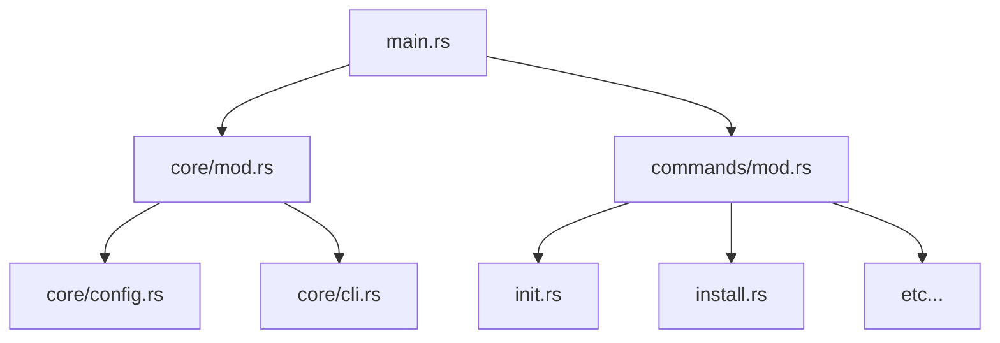

# Consolidated Documentation

This file consolidates all implementation plans, tasks, and walkthroughs from the directory.

## Implementation Plans

### Original implementation_plan.md

# Match Expression Implementation Checklist

- [ ] [T4.3] Match Expression 🧩
  - [x] Lexer: Add `match` keyword
  - [x] AST: Define `Pattern`, `MatchArm`, and `Expr::Match`
  - [x] Parser: Implement `parse_match_expression` and `parse_pattern`
  - [ ] Interpreter: Implement `eval_match` and `match_pattern` logic
  - [ ] Verification: Test all pattern types (literals, vars, arrays, objects, tuples) and guards

### implementation_plan.md.resolved

# Implementation Plan - Match Expression

Implement a powerful pattern matching system inspired by Rust and Elixir.

## Proposed Changes

### [dryad_lexer]
#### [MODIFY] [lexer.rs](file:///c:/Users/Pedro Jesus/Downloads/source-main/source-main/crates/dryad_lexer/src/lexer.rs)
- Add `"match"` to the keywords list in the [identifier](file:///c:/Users/Pedro%20Jesus/Downloads/source-main/source-main/crates/dryad_lexer/src/lexer.rs#419-442) method.

### [dryad_parser]
#### [MODIFY] [ast.rs](file:///c:/Users/Pedro Jesus/Downloads/source-main/source-main/crates/dryad_parser/src/ast.rs)
- Add `Pattern` enum:
  ```rust
  pub enum Pattern {
      Literal(Literal),
      Identifier(String), // Binding
      Wildcard,          // _
      Array(Vec<Pattern>),
      Tuple(Vec<Pattern>),
      Object(Vec<(String, Pattern)>),
  }
  ```
- Add `MatchArm` struct:
  ```rust
  pub struct MatchArm {
      pub pattern: Pattern,
      pub guard: Option<Expr>,
      pub body: Stmt,
      pub location: SourceLocation,
  }
  ```
- Add `Expr::Match(Box<Expr>, Vec<MatchArm>, SourceLocation)` to the `Expr` enum.

#### [MODIFY] [parser.rs](file:///c:/Users/Pedro Jesus/Downloads/source-main/source-main/crates/dryad_parser/src/parser.rs)
- Update [primary](file:///c:/Users/Pedro%20Jesus/Downloads/source-main/source-main/crates/dryad_parser/src/parser.rs#629-880) to handle `Token::Keyword(k) if k == "match"`.
- Implement `parse_match_expression()`: parses the target expression and the arms inside `{}`.
- Implement `parse_pattern()`: parses the pattern syntax (literals, `_`, `[...]`, [(...)](file:///c:/Users/Pedro%20Jesus/Downloads/source-main/source-main/crates/dryad_runtime/src/interpreter.rs#3152-3172), `{...}`).

### [dryad_runtime]
#### [MODIFY] [interpreter.rs](file:///c:/Users/Pedro Jesus/Downloads/source-main/source-main/crates/dryad_runtime/src/interpreter.rs)
- Implement `eval_match`:
  - Evaluate the target expression.
  - Iterate through `MatchArm`s.
  - Call `match_pattern(value, pattern)` to check for a match and collect bindings.
  - If a match is found and the optional guard evaluates to true:
    - Create a new scope with the bindings.
    - Execute the arm's body.
    - Return the result.
- Implement `match_pattern(value, pattern)`: recursive logic for comparing values against patterns and extracting bindings.

## Verification Plan

### Automated Tests
- Create a test file `match_tests.dry` or add unit tests to [interpreter.rs](file:///c:/Users/Pedro%20Jesus/Downloads/source-main/source-main/crates/dryad_runtime/src/interpreter.rs) covering:
  - Basic literal matching.
  - Variable binding (`match x { y => y }`).
  - Wildcard `_`.
  - Array destructuring (`[a, b, ...]`).
  - Tuple destructuring ([(a, b, ...)](file:///c:/Users/Pedro%20Jesus/Downloads/source-main/source-main/crates/dryad_runtime/src/interpreter.rs#3152-3172)).
  - Object destructuring (`{key: value}`).
  - Guards (`... if condition`).
  - Nested patterns.

### Manual Verification
- Execute complex Dryad scripts using the new [match](file:///c:/Users/Pedro%20Jesus/Downloads/source-main/source-main/crates/dryad_parser/src/parser.rs#1687-1696) expression to ensure correct behavior in real-world-like scenarios.

### implementation_plan.md.resolved.0

# Implementation Plan - Refactoring and Hardening Dryad Runtime and Oak

This plan covers security improvements in the Dryad runtime, protection against stack overflow, and architectural cleanup of the Oak package manager.

## Proposed Changes

### Dryad Runtime (crates/dryad_runtime)

#### [MODIFY] [mod.rs](file:///c:/Users/Pedro%20Jesus/Downloads/source-main/source-main/crates/dryad_runtime/src/native_modules/mod.rs)
- Modify `NativeFunction` type to include access to security flags.
  ```rust
  pub type NativeFunction = fn(&[Value], &NativeModuleManager) -> Result<Value, RuntimeError>;
  ```
- Add `allow_unsafe: bool` to [NativeModuleManager](file:///c:/Users/Pedro%20Jesus/Downloads/source-main/source-main/crates/dryad_runtime/src/native_modules/mod.rs#32-38).
- Update all native function calls and registrations to match the new signature.

#### [MODIFY] [interpreter.rs](file:///c:/Users/Pedro%20Jesus/Downloads/source-main/source-main/crates/dryad_runtime/src/interpreter.rs)
- Add `allow_unsafe: bool` and `call_depth: usize` to [Interpreter](file:///c:/Users/Pedro%20Jesus/Downloads/source-main/source-main/crates/dryad_runtime/src/interpreter.rs#17-35).
- Define `MAX_RECURSION_DEPTH: usize = 1000`.
- Update [call_user_function](file:///c:/Users/Pedro%20Jesus/Downloads/source-main/source-main/crates/dryad_runtime/src/interpreter.rs#757-821) to increment/decrement `call_depth` and check against 1000.
- Throw `DryadError::Runtime` with code `3024` for Stack Overflow.
- Synchronize `allow_unsafe` flag with [NativeModuleManager](file:///c:/Users/Pedro%20Jesus/Downloads/source-main/source-main/crates/dryad_runtime/src/native_modules/mod.rs#32-38).

#### [MODIFY] [system_env.rs](file:///c:/Users/Pedro%20Jesus/Downloads/source-main/source-main/crates/dryad_runtime/src/native_modules/system_env.rs)
- Update [native_exec](file:///c:/Users/Pedro%20Jesus/Downloads/source-main/source-main/crates/dryad_runtime/src/native_modules/system_env.rs#115-147) and [native_exec_output](file:///c:/Users/Pedro%20Jesus/Downloads/source-main/source-main/crates/dryad_runtime/src/native_modules/system_env.rs#148-180) to check `manager.allow_unsafe()`.
- Throw `RuntimeError::SystemError` if unsafe execution is attempted without the flag.

---

### Oak Package Manager (crates/oak)

#### [NEW] [config.rs](file:///c:/Users/Pedro%20Jesus/Downloads/source-main/source-main/crates/oak/src/core/config.rs)
- Move content from [src/config.rs](file:///c:/Users/Pedro%20Jesus/Downloads/source-main/source-main/crates/oak/src/config.rs) to `src/core/config.rs`.

#### [DELETE] [config.rs](file:///c:/Users/Pedro%20Jesus/Downloads/source-main/source-main/crates/oak/src/config.rs)

#### [MODIFY] [main.rs](file:///c:/Users/Pedro%20Jesus/Downloads/source-main/source-main/crates/oak/src/main.rs)
- Move [Cli](file:///c:/Users/Pedro%20Jesus/Downloads/source-main/source-main/crates/oak/src/main.rs#16-20), `Commands`, and `RegistryAction` enums to [src/commands/mod.rs](file:///c:/Users/Pedro%20Jesus/Downloads/source-main/source-main/crates/oak/src/commands/mod.rs) or `src/core/cli.rs`.
- Refactor [main](file:///c:/Users/Pedro%20Jesus/Downloads/source-main/source-main/crates/oak/src/main.rs#85-134) to be a thin wrapper.

---

### Documentation Update (@[docs])

#### [MODIFY] [internals.md](file:///c:/Users/Pedro%20Jesus/Downloads/source-main/source-main/docs/internals.md)
- Document the new recursion limit and the `--allow-unsafe` requirement for [native_exec](file:///c:/Users/Pedro%20Jesus/Downloads/source-main/source-main/crates/dryad_runtime/src/native_modules/system_env.rs#115-147).

## Verification Plan

### Automated Tests
- Run existing tests to ensure no regressions: `cargo test -p dryad_runtime`
- Create a new test case in `dryad_runtime` for recursion depth:
  ```dryad
  func infinite() { infinite(); }
  infinite();
  ```
- Create a test case for [native_exec](file:///c:/Users/Pedro%20Jesus/Downloads/source-main/source-main/crates/dryad_runtime/src/native_modules/system_env.rs#115-147) with and without `--allow-unsafe`.

### Manual Verification
- Test `oak` CLI commands after refactoring:
  - `oak init test_project`
  - `oak install`
  - Verify they still work as expected.

### implementation_plan.md.resolved.1

# Implementation Plan - Refactoring and Hardening Dryad Runtime and Oak

This plan covers security improvements in the Dryad runtime, protection against stack overflow, and architectural cleanup of the Oak package manager.

## Proposed Changes

### Dryad Runtime (crates/dryad_runtime)

#### [MODIFY] [mod.rs](file:///c:/Users/Pedro%20Jesus/Downloads/source-main/source-main/crates/dryad_runtime/src/native_modules/mod.rs)

- Modify `NativeFunction` type to include access to security flags.
  ```rust
  pub type NativeFunction = fn(&[Value], &NativeModuleManager) -> Result<Value, RuntimeError>;
  ```
- Add `allow_unsafe: bool` to [NativeModuleManager](file:///c:/Users/Pedro%20Jesus/Downloads/source-main/source-main/crates/dryad_runtime/src/native_modules/mod.rs#32-40).
- Update all native function calls and registrations to match the new signature.

#### [MODIFY] [interpreter.rs](file:///c:/Users/Pedro%20Jesus/Downloads/source-main/source-main/crates/dryad_runtime/src/interpreter.rs)

- Add `allow_unsafe: bool` and `call_depth: usize` to [Interpreter](file:///c:/Users/Pedro%20Jesus/Downloads/source-main/source-main/crates/dryad_runtime/src/interpreter.rs#17-34).
- Define `MAX_RECURSION_DEPTH: usize = 1000`.
- Update [call_user_function](file:///c:/Users/Pedro%20Jesus/Downloads/source-main/source-main/crates/dryad_runtime/src/interpreter.rs#758-822) to increment/decrement `call_depth` and check against 1000.
- Throw `DryadError::Runtime` with code `3040` for Stack Overflow.
- Synchronize [allow_unsafe](file:///c:/Users/Pedro%20Jesus/Downloads/source-main/source-main/crates/dryad_runtime/src/native_modules/mod.rs#169-172) flag with [NativeModuleManager](file:///c:/Users/Pedro%20Jesus/Downloads/source-main/source-main/crates/dryad_runtime/src/native_modules/mod.rs#32-40).

#### [MODIFY] [system_env.rs](file:///c:/Users/Pedro%20Jesus/Downloads/source-main/source-main/crates/dryad_runtime/src/native_modules/system_env.rs)

- Update [native_exec](file:///c:/Users/Pedro%20Jesus/Downloads/source-main/source-main/crates/dryad_runtime/src/native_modules/system_env.rs#115-150) and [native_exec_output](file:///c:/Users/Pedro%20Jesus/Downloads/source-main/source-main/crates/dryad_runtime/src/native_modules/system_env.rs#151-186) to check `manager.allow_unsafe()`.
- Throw `RuntimeError::SystemError` if unsafe execution is attempted without the flag.

---

### Oak Package Manager (crates/oak)

#### [NEW] [config.rs](file:///c:/Users/Pedro%20Jesus/Downloads/source-main/source-main/crates/oak/src/core/config.rs)

- Move content from [src/config.rs](file:///c:/Users/Pedro%20Jesus/Downloads/source-main/source-main/crates/oak/src/config.rs) to `src/core/config.rs`.

#### [DELETE] [config.rs](file:///c:/Users/Pedro%20Jesus/Downloads/source-main/source-main/crates/oak/src/config.rs)

#### [MODIFY] [main.rs](file:///c:/Users/Pedro%20Jesus/Downloads/source-main/source-main/crates/oak/src/main.rs)

- Move [Cli](file:///c:/Users/Pedro%20Jesus/Downloads/source-main/source-main/crates/oak/src/main.rs#16-20), `Commands`, and `RegistryAction` enums to [src/commands/mod.rs](file:///c:/Users/Pedro%20Jesus/Downloads/source-main/source-main/crates/oak/src/commands/mod.rs) or `src/core/cli.rs`.
- Refactor [main](file:///c:/Users/Pedro%20Jesus/Downloads/source-main/source-main/crates/oak/src/main.rs#85-134) to be a thin wrapper.

---

### Documentation Update (@[docs])

#### [MODIFY] [internals.md](file:///c:/Users/Pedro%20Jesus/Downloads/source-main/source-main/docs/internals.md)

- Document the new recursion limit and the `--allow-unsafe` requirement for [native_exec](file:///c:/Users/Pedro%20Jesus/Downloads/source-main/source-main/crates/dryad_runtime/src/native_modules/system_env.rs#115-150).

## Verification Plan

### Automated Tests

- Run existing tests to ensure no regressions: `cargo test -p dryad_runtime`
- Create a new test case in `dryad_runtime` for recursion depth:
  ```dryad
  func infinite() { infinite(); }
  infinite();
  ```
- Create a test case for [native_exec](file:///c:/Users/Pedro%20Jesus/Downloads/source-main/source-main/crates/dryad_runtime/src/native_modules/system_env.rs#115-150) with and without `--allow-unsafe`.

### Manual Verification

- Test `oak` CLI commands after refactoring:
  - `oak init test_project`
  - `oak install`
  - Verify they still work as expected.

### implementation_plan.md.resolved.2

# Implementation Plan - Array Methods v2 and Oak Checksum Validation

This plan covers the implementation of comprehensive native methods for Dryad arrays and integrity validation for the Oak package manager.

## Proposed Changes

### Dryad Runtime (crates/dryad_runtime)

#### [MODIFY] [interpreter.rs](file:///c:/Users/Pedro%20Jesus/Downloads/source-main/source-main/crates/dryad_runtime/src/interpreter.rs)

- Update [eval_method_call_internal](file:///c:/Users/Pedro%20Jesus/Downloads/source-main/source-main/crates/dryad_runtime/src/interpreter.rs#1589-1823) to handle `Value::Array`.
- Implement `eval_array_method(&mut self, elements: Vec<Value>, method_name: &str, args: &[Expr]) -> Result<Value, DryadError>`.
- **Implement 33 native methods** for arrays categorized as:
  1. **Basic**: [push](file:///c:/Users/Pedro%20Jesus/Downloads/source-main/source-main/crates/dryad_errors/src/lib.rs#80-83), `pop`, [shift](file:///c:/Users/Pedro%20Jesus/Downloads/source-main/source-main/crates/dryad_runtime/src/interpreter.rs#1141-1155), `unshift`, `length`.
  2. **Mapping/Filtering**: `map`, `filter`, `forEach`, `reduce`, `reduceRight`.
  3. **Search/Inspection**: `includes`, `indexOf`, `lastIndexOf`, [find](file:///c:/Users/Pedro%20Jesus/Downloads/source-main/source-main/crates/oak/src/registry.rs#17-74), `findIndex`, `every`, `some`.
  4. **Transformation/Ordering**: `sort`, `reverse`, `slice`, `concat`, `join`.
  5. **Advanced**: `unique`, `flatten`, [chunk](file:///c:/Users/Pedro%20Jesus/Downloads/source-main/source-main/crates/dryad_runtime/src/native_modules/binary_io.rs#175-253), `groupBy`, `zip`, `reverseMap`, `fill`, `copyWithin`.

> [!NOTE]
> Functional methods (map, filter, etc.) will call the provided callback value using a new internal helper `call_function_value`.

---

### Oak Package Manager (crates/oak)

#### [MODIFY] [registry.rs](file:///c:/Users/Pedro%20Jesus/Downloads/source-main/source-main/crates/oak/src/registry.rs)

- Update [RegistryPackageInfo](file:///c:/Users/Pedro%20Jesus/Downloads/source-main/source-main/crates/oak/src/registry.rs#10-16) to include an optional [hash](file:///c:/Users/Pedro%20Jesus/Downloads/source-main/source-main/crates/dryad_runtime/src/native_modules/crypto.rs#70-101) field for checksum validation.
  ```rust
  pub struct RegistryPackageInfo {
      // ... existing fields
      pub hash: Option<String>,
  }
  ```

#### [MODIFY] [install.rs](file:///c:/Users/Pedro%20Jesus/Downloads/source-main/source-main/crates/oak/src/commands/install.rs)

- Implement SHA-256 calculation for downloaded package content.
- Update [install_single_package](file:///c:/Users/Pedro%20Jesus/Downloads/source-main/source-main/crates/oak/src/commands/install.rs#40-105) to verify the hash if provided by the registry.
- Abort installation with an error if the hash doesn't match.

## Verification Plan

### Automated Tests
- **Array Methods**: Create a comprehensive Dryad script `tests/array_v2_test.dryad` testing all categories of methods.
- **Oak Checksum**: 
  - Mock a registry response with an incorrect hash and verify Oak aborts.
  - Verify successful installation when hashes match.

### Manual Verification
- Test various array methods in the Dryad REPL or via `dryad run`.
- Run `oak install` and ensure normal packages still install correctly.

### implementation_plan.md.resolved.3

# Implementation Plan - Array Methods v2 and Oak Checksum Validation

This plan covers the implementation of comprehensive native methods for Dryad arrays and integrity validation for the Oak package manager.

## Proposed Changes

### Dryad Runtime (crates/dryad_runtime)

#### [MODIFY] [interpreter.rs](file:///c:/Users/Pedro%20Jesus/Downloads/source-main/source-main/crates/dryad_runtime/src/interpreter.rs)

- Update [eval_method_call_internal](file:///c:/Users/Pedro%20Jesus/Downloads/source-main/source-main/crates/dryad_runtime/src/interpreter.rs#1589-1823) to handle `Value::Array`.
- Implement `eval_array_method(&mut self, object_expr: &Expr, method_name: &str, args: &[Expr]) -> Result<Value, DryadError>`.
- **Mutation Handling**: For methods like [push](file:///c:/Users/Pedro%20Jesus/Downloads/source-main/source-main/crates/dryad_errors/src/lib.rs#80-83), `pop`, [shift](file:///c:/Users/Pedro%20Jesus/Downloads/source-main/source-main/crates/dryad_runtime/src/interpreter.rs#1123-1137), `unshift`, `sort`, `reverse`, `fill`, and `copyWithin`, if `object_expr` is a variable, the updated array will be written back to the interpreter's variables.
- **Implement 33 native methods** categorized as:
  1. **Basic**: [push](file:///c:/Users/Pedro%20Jesus/Downloads/source-main/source-main/crates/dryad_errors/src/lib.rs#80-83), `pop`, [shift](file:///c:/Users/Pedro%20Jesus/Downloads/source-main/source-main/crates/dryad_runtime/src/interpreter.rs#1123-1137), `unshift`, `length`.
  2. **Mapping/Filtering**: `map`, `filter`, `forEach`, `reduce`, `reduceRight`.
  3. **Search/Inspection**: `includes`, `indexOf`, `lastIndexOf`, [find](file:///c:/Users/Pedro%20Jesus/Downloads/source-main/source-main/crates/oak/src/registry.rs#17-74), `findIndex`, `every`, `some`.
  4. **Transformation/Ordering**: `sort`, `reverse`, `slice`, `concat`, `join`.
  5. **Advanced**: `unique`, `flatten`, [chunk](file:///c:/Users/Pedro%20Jesus/Downloads/source-main/source-main/crates/dryad_runtime/src/native_modules/binary_io.rs#175-253), `groupBy`, `zip`, `reverseMap`, `fill`, `copyWithin`.

> [!NOTE]
> Functional methods (map, filter, etc.) will call the provided callback value using a new internal helper `call_function_value`.

---

### Oak Package Manager (crates/oak)

#### [MODIFY] [registry.rs](file:///c:/Users/Pedro%20Jesus/Downloads/source-main/source-main/crates/oak/src/registry.rs)

- Update [RegistryPackageInfo](file:///c:/Users/Pedro%20Jesus/Downloads/source-main/source-main/crates/oak/src/registry.rs#10-16) to include an optional [hash](file:///c:/Users/Pedro%20Jesus/Downloads/source-main/source-main/crates/dryad_runtime/src/native_modules/crypto.rs#70-101) field for checksum validation.
  ```rust
  pub struct RegistryPackageInfo {
      // ... existing fields
      pub hash: Option<String>,
  }
  ```

#### [MODIFY] [install.rs](file:///c:/Users/Pedro%20Jesus/Downloads/source-main/source-main/crates/oak/src/commands/install.rs)

- Implement SHA-256 calculation for downloaded package content.
- Update [install_single_package](file:///c:/Users/Pedro%20Jesus/Downloads/source-main/source-main/crates/oak/src/commands/install.rs#40-105) to verify the hash if provided by the registry.
- Abort installation with an error if the hash doesn't match.

## Verification Plan

### Automated Tests

- **Array Methods**: Create a comprehensive Dryad script `tests/array_v2_test.dryad` testing all categories of methods.
- **Oak Checksum**:
  - Mock a registry response with an incorrect hash and verify Oak aborts.
  - Verify successful installation when hashes match.

### Manual Verification

- Test various array methods in the Dryad REPL or via `dryad run`.
- Run `oak install` and ensure normal packages still install correctly.

### implementation_plan.md.resolved.4

# Implementation Plan - Array Methods v2 and Oak Checksum Validation

This plan covers the implementation of comprehensive native methods for Dryad arrays and integrity validation for the Oak package manager.

## Proposed Changes

### Dryad Runtime (crates/dryad_runtime)

#### [MODIFY] [interpreter.rs](file:///c:/Users/Pedro%20Jesus/Downloads/source-main/source-main/crates/dryad_runtime/src/interpreter.rs)

- Update [eval_method_call_internal](file:///c:/Users/Pedro%20Jesus/Downloads/source-main/source-main/crates/dryad_runtime/src/interpreter.rs#1589-1823) to handle `Value::Array`.
- Implement `eval_array_method(&mut self, object_expr: &Expr, method_name: &str, args: &[Expr]) -> Result<Value, DryadError>`.
- **Mutation Handling**: For methods like [push](file:///c:/Users/Pedro%20Jesus/Downloads/source-main/source-main/crates/dryad_errors/src/lib.rs#80-83), `pop`, [shift](file:///c:/Users/Pedro%20Jesus/Downloads/source-main/source-main/crates/dryad_runtime/src/interpreter.rs#1141-1155), `unshift`, `sort`, `reverse`, `fill`, and `copyWithin`, if `object_expr` is a variable, the updated array will be written back to the interpreter's variables.
- **Implement 33 native methods** categorized as:
  1. **Basic**: [push](file:///c:/Users/Pedro%20Jesus/Downloads/source-main/source-main/crates/dryad_errors/src/lib.rs#80-83), `pop`, [shift](file:///c:/Users/Pedro%20Jesus/Downloads/source-main/source-main/crates/dryad_runtime/src/interpreter.rs#1141-1155), `unshift`, `length`.
  2. **Mapping/Filtering**: `map`, `filter`, `forEach`, `reduce`, `reduceRight`.
  3. **Search/Inspection**: `includes`, `indexOf`, `lastIndexOf`, [find](file:///c:/Users/Pedro%20Jesus/Downloads/source-main/source-main/crates/oak/src/registry.rs#17-74), `findIndex`, `every`, `some`.
  4. **Transformation/Ordering**: `sort`, `reverse`, `slice`, `concat`, `join`.
  5. **Advanced**: `unique`, `flatten`, [chunk](file:///c:/Users/Pedro%20Jesus/Downloads/source-main/source-main/crates/dryad_runtime/src/native_modules/binary_io.rs#175-253), `groupBy`, `zip`, `reverseMap`, `fill`, `copyWithin`.

> [!NOTE]
> Functional methods (map, filter, etc.) will call the provided callback value using a new internal helper `call_function_value`.

---

### Oak Package Manager (crates/oak)

#### [MODIFY] [registry.rs](file:///c:/Users/Pedro%20Jesus/Downloads/source-main/source-main/crates/oak/src/registry.rs)

- Update [RegistryPackageInfo](file:///c:/Users/Pedro%20Jesus/Downloads/source-main/source-main/crates/oak/src/registry.rs#10-16) to include an optional [hash](file:///c:/Users/Pedro%20Jesus/Downloads/source-main/source-main/crates/dryad_runtime/src/native_modules/crypto.rs#70-101) field for checksum validation.
  ```rust
  pub struct RegistryPackageInfo {
      // ... existing fields
      pub hash: Option<String>,
  }
  ```

#### [MODIFY] [install.rs](file:///c:/Users/Pedro%20Jesus/Downloads/source-main/source-main/crates/oak/src/commands/install.rs)

- Implement SHA-256 calculation for downloaded package content.
- Update [install_single_package](file:///c:/Users/Pedro%20Jesus/Downloads/source-main/source-main/crates/oak/src/commands/install.rs#40-105) to verify the hash if provided by the registry.
- Abort installation with an error if the hash doesn't match.

### Mock Registry (dryad-registry-mock)

#### [MODIFY] [server.js](file:///c:/Users/Pedro%20Jesus/Downloads/source-main/source-main/dryad-registry-mock/server.js)
- Add a [hash](file:///c:/Users/Pedro%20Jesus/Downloads/source-main/source-main/crates/dryad_runtime/src/native_modules/crypto.rs#70-101) field to the package metadata in the mock database.
- Use a placeholder SHA-256 hash for testing purposes (e.g., hash of an empty file or a specific string).

## Verification Plan

### Automated Tests

- **Array Methods**: Create a comprehensive Dryad script `tests/array_v2_test.dryad` testing all categories of methods.
- **Oak Checksum**:
  - Mock a registry response with an incorrect hash and verify Oak aborts.
  - Verify successful installation when hashes match.

### Manual Verification

- Test various array methods in the Dryad REPL or via `dryad run`.
- Run `oak install` and ensure normal packages still install correctly.

### implementation_plan.md.resolved.5

# Oak Checksum Validation Implementation Plan

This plan outlines the steps to implement SHA-256 checksum validation for packages installed by the Oak package manager. This ensures package integrity and protects against tampering.

## User Review Required

> [!IMPORTANT]
> **Git-based Verification**: Since Oak currently uses `git clone`, the checksum will be calculated on the final state of the `oak_modules/<package>` directory (after removing the `.git` folder). This ensures that the installed files match the registry expectations, regardless of the cloning process.

> [!WARNING]
> If a package has a hash registered but the validation fails, the installation will be **aborted** and the package files removed for security.

## Proposed Changes

### [Component] Oak Package Manager

#### [MODIFY] [registry.rs](file:///c:/Users/Pedro%20Jesus/Downloads/source-main/source-main/crates/oak/src/registry.rs)
- Add `pub hash: Option<String>` to the [RegistryPackageInfo](file:///c:/Users/Pedro%20Jesus/Downloads/source-main/source-main/crates/oak/src/registry.rs#10-16) struct to store the expected SHA-256 hash.

#### [MODIFY] [install.rs](file:///c:/Users/Pedro%20Jesus/Downloads/source-main/source-main/crates/oak/src/commands/install.rs)
- Implement a `calculate_dir_hash` helper function using the [sha2](file:///c:/Users/Pedro%20Jesus/Downloads/source-main/source-main/crates/dryad_runtime/src/native_modules/crypto.rs#39-70) crate.
- In [install_single_package](file:///c:/Users/Pedro%20Jesus/Downloads/source-main/source-main/crates/oak/src/commands/install.rs#40-105), after cloning and cleaning up `.git`, calculate the directory hash.
- Compare calculated hash with the one from `pkg_info.hash` (if provided).
- Add logic to abort installation and cleanup on hash mismatch.

---

### [Component] Dryad Registry Mock

#### [MODIFY] [server.js](file:///c:/Users/Pedro%20Jesus/Downloads/source-main/source-main/dryad-registry-mock/server.js)
- Add placeholder SHA-256 hashes to existing mock packages to enable testing of the validation logic.

## Verification Plan

### Automated Tests
1. **Mock Hash Testing**:
   - Update a mock package in `dryad-registry-mock` with a known hash.
   - Run `oak install <package>` and verify it completes successfully if hashes match.
   - Intentionally put a WRONG hash in the mock and verify `oak install` fails with a security warning.

### Manual Verification
1. Inspect the `oak_modules` directory after a successful install to ensure only the package files remain (no `.git`).
2. Verify that dependency installation still works recursively with checksums enabled.

### implementation_plan.md.resolved.6

# Implementation Plan - Template Strings and Async File I/O

This plan outlines the steps to add Template String support and migrate File I/O to an asynchronous model using Tokio.

## Proposed Changes

### 1. Template Strings (String Interpolation)

The goal is to support `${expression}` inside backtick-delimited strings (`` `...` ``).

#### [MODIFY] [token.rs](file:///c:/Users/Pedro%20Jesus/Downloads/source-main/source-main/crates/dryad_lexer/src/token.rs)
- Add token types for Template Strings:
  - `TemplateStart` (`` ` ``)
  - `TemplateEnd` (`` ` ``)
  - `TemplateContent(String)` (text between interpolation or delimiters)
  - `InterpolationStart` (`${`)
  - `InterpolationEnd` (`}`)

#### [MODIFY] [lexer.rs](file:///c:/Users/Pedro%20Jesus/Downloads/source-main/source-main/crates/dryad_lexer/src/lexer.rs)
- Update [next_token](file:///c:/Users/Pedro%20Jesus/Downloads/source-main/source-main/crates/dryad_lexer/src/lexer.rs#51-236) to handle backticks.
- When a backtick is encountered, enter a "template mode" to handle nested interpolation and literal text.

#### [MODIFY] [parser.rs](file:///c:/Users/Pedro%20Jesus/Downloads/source-main/source-main/crates/dryad_parser/src/parser.rs)
- Implement `parse_template_string`.
- **AST Mapping**: Instead of creating a new AST node, Template Strings will be parsed into a tree of `Binary` expressions using the `+` operator.
  - Example: `` `Value: ${x}` `` -> `"Value: " + x`
  - This ensures compatibility with the existing runtime and simplifies implementation.

---

### 2. Async File I/O Migration

The goal is to prevent blocking the main thread during I/O operations by using `tokio::fs` and [async](file:///c:/Users/Pedro%20Jesus/Downloads/source-main/source-main/crates/dryad_parser/src/parser.rs#1330-1383) native functions.

#### [MODIFY] [mod.rs](file:///c:/Users/Pedro%20Jesus/Downloads/source-main/source-main/crates/dryad_runtime/src/native_modules/mod.rs)
- Define `AsyncNativeFunction` type:
  ```rust
  pub type AsyncNativeFunction = fn(Vec<Value>, &NativeModuleManager) -> Pin<Box<dyn Future<Output = Result<Value, RuntimeError>> + Send>>;
  ```
- Update [NativeModuleManager](file:///c:/Users/Pedro%20Jesus/Downloads/source-main/source-main/crates/dryad_runtime/src/native_modules/mod.rs#32-40) to support registering and retrieving async functions.

#### [MODIFY] [file_io.rs](file:///c:/Users/Pedro%20Jesus/Downloads/source-main/source-main/crates/dryad_runtime/src/native_modules/file_io.rs)
- Replace `std::fs` with `tokio::fs`.
- Update function signatures to [async](file:///c:/Users/Pedro%20Jesus/Downloads/source-main/source-main/crates/dryad_parser/src/parser.rs#1330-1383).
- Update [register_file_io_functions](file:///c:/Users/Pedro%20Jesus/Downloads/source-main/source-main/crates/dryad_runtime/src/native_modules/file_io.rs#10-27) to use the new async registration.

#### [MODIFY] [interpreter.rs](file:///c:/Users/Pedro%20Jesus/Downloads/source-main/source-main/crates/dryad_runtime/src/interpreter.rs)
- Update [eval_call_by_name](file:///c:/Users/Pedro%20Jesus/Downloads/source-main/source-main/crates/dryad_runtime/src/interpreter.rs#717-760) to handle `AsyncNativeFunction`.
  - When an async native function is called, it will return a `Value::Promise`.
- Update [eval_await](file:///c:/Users/Pedro%20Jesus/Downloads/source-main/source-main/crates/dryad_runtime/src/interpreter.rs#2001-2013) to support awaiting these promises.
- **Note**: To fully realize non-blocking I/O, we will eventually need to make the interpreter's [evaluate](file:///c:/Users/Pedro%20Jesus/Downloads/source-main/source-main/crates/dryad_runtime/src/interpreter.rs#577-632) and [execute_statement](file:///c:/Users/Pedro%20Jesus/Downloads/source-main/source-main/crates/dryad_runtime/src/interpreter.rs#277-579) methods [async](file:///c:/Users/Pedro%20Jesus/Downloads/source-main/source-main/crates/dryad_parser/src/parser.rs#1330-1383). This plan focuses on the foundation for that migration.

## Verification Plan

### Automated Tests
- `cargo test` to ensure existing features still work.
- New test file `tests/template_strings.dryad` to verify interpolation.
- New test file `tests/async_io.dryad` to verify `await readFile(...)`.

### Manual Verification
- Run sample Dryad scripts that use template strings and file operations.
- Verify that large file reads do not freeze the interpreter (if testing in a multi-threaded context).

### implementation_plan.md.resolved.7

# Implementation Plan - Match Expression

Implement a powerful pattern matching system inspired by Rust and Elixir.

## Proposed Changes

### [dryad_lexer]
#### [MODIFY] [lexer.rs](file:///c:/Users/Pedro Jesus/Downloads/source-main/source-main/crates/dryad_lexer/src/lexer.rs)
- Add `"match"` to the keywords list in the [identifier](file:///c:/Users/Pedro%20Jesus/Downloads/source-main/source-main/crates/dryad_lexer/src/lexer.rs#419-442) method.

### [dryad_parser]
#### [MODIFY] [ast.rs](file:///c:/Users/Pedro Jesus/Downloads/source-main/source-main/crates/dryad_parser/src/ast.rs)
- Add `Pattern` enum:
  ```rust
  pub enum Pattern {
      Literal(Literal),
      Identifier(String), // Binding
      Wildcard,          // _
      Array(Vec<Pattern>),
      Tuple(Vec<Pattern>),
      Object(Vec<(String, Pattern)>),
  }
  ```
- Add `MatchArm` struct:
  ```rust
  pub struct MatchArm {
      pub pattern: Pattern,
      pub guard: Option<Expr>,
      pub body: Stmt,
      pub location: SourceLocation,
  }
  ```
- Add `Expr::Match(Box<Expr>, Vec<MatchArm>, SourceLocation)` to the `Expr` enum.

#### [MODIFY] [parser.rs](file:///c:/Users/Pedro Jesus/Downloads/source-main/source-main/crates/dryad_parser/src/parser.rs)
- Update [primary](file:///c:/Users/Pedro%20Jesus/Downloads/source-main/source-main/crates/dryad_parser/src/parser.rs#629-880) to handle `Token::Keyword(k) if k == "match"`.
- Implement `parse_match_expression()`: parses the target expression and the arms inside `{}`.
- Implement `parse_pattern()`: parses the pattern syntax (literals, `_`, `[...]`, [(...)](file:///c:/Users/Pedro%20Jesus/Downloads/source-main/source-main/crates/dryad_runtime/src/interpreter.rs#3152-3172), `{...}`).

### [dryad_runtime]
#### [MODIFY] [interpreter.rs](file:///c:/Users/Pedro Jesus/Downloads/source-main/source-main/crates/dryad_runtime/src/interpreter.rs)
- Implement `eval_match`:
  - Evaluate the target expression.
  - Iterate through `MatchArm`s.
  - Call `match_pattern(value, pattern)` to check for a match and collect bindings.
  - If a match is found and the optional guard evaluates to true:
    - Create a new scope with the bindings.
    - Execute the arm's body.
    - Return the result.
- Implement `match_pattern(value, pattern)`: recursive logic for comparing values against patterns and extracting bindings.

## Verification Plan

### Automated Tests
- Create a test file `match_tests.dry` or add unit tests to [interpreter.rs](file:///c:/Users/Pedro%20Jesus/Downloads/source-main/source-main/crates/dryad_runtime/src/interpreter.rs) covering:
  - Basic literal matching.
  - Variable binding (`match x { y => y }`).
  - Wildcard `_`.
  - Array destructuring (`[a, b, ...]`).
  - Tuple destructuring ([(a, b, ...)](file:///c:/Users/Pedro%20Jesus/Downloads/source-main/source-main/crates/dryad_runtime/src/interpreter.rs#3152-3172)).
  - Object destructuring (`{key: value}`).
  - Guards (`... if condition`).
  - Nested patterns.

### Manual Verification
- Execute complex Dryad scripts using the new [match](file:///c:/Users/Pedro%20Jesus/Downloads/source-main/source-main/crates/dryad_parser/src/parser.rs#1687-1696) expression to ensure correct behavior in real-world-like scenarios.

## Tasks

### Original task.md

# Match Expression Implementation Checklist

- [ ] [T4.3] Match Expression 🧩
  - [x] Lexer: Add `match` keyword
  - [x] AST: Define `Pattern`, `MatchArm`, and `Expr::Match`
  - [x] Parser: Implement `parse_match_expression` and `parse_pattern`
  - [ ] Interpreter: Implement `eval_match` and `match_pattern` logic
  - [ ] Verification: Test all pattern types (literals, vars, arrays, objects, tuples) and guards

### task.md.resolved

# Match Expression Implementation Checklist

- [ ] [T4.3] Match Expression 🧩
    - [x] Lexer: Add [match](file:///c:/Users/Pedro%20Jesus/Downloads/source-main/source-main/crates/dryad_runtime/src/interpreter.rs#2065-2106) keyword
    - [x] AST: Define `Pattern`, [MatchArm](file:///c:/Users/Pedro%20Jesus/Downloads/source-main/source-main/crates/dryad_parser/src/ast.rs#80-86), and `Expr::Match`
    - [x] Parser: Implement [parse_match_expression](file:///c:/Users/Pedro%20Jesus/Downloads/source-main/source-main/crates/dryad_parser/src/parser.rs#2316-2378) and [parse_pattern](file:///c:/Users/Pedro%20Jesus/Downloads/source-main/source-main/crates/dryad_parser/src/parser.rs#2379-2488)
    - [ ] Interpreter: Implement [eval_match](file:///c:/Users/Pedro%20Jesus/Downloads/source-main/source-main/crates/dryad_runtime/src/interpreter.rs#2065-2106) and [match_pattern](file:///c:/Users/Pedro%20Jesus/Downloads/source-main/source-main/crates/dryad_runtime/src/interpreter.rs#2107-2171) logic
    - [ ] Verification: Test all pattern types (literals, vars, arrays, objects, tuples) and guards

### task.md.resolved.0

# Task: Refactoring and Hardening Dryad Runtime and Oak

- [ ] Planning and Analysis [/]
    - [ ] Explore `dryad_errors` for `StackOverflow` error type [ ]
    - [ ] Create `implementation_plan.md` [ ]
- [ ] Implement T1.1: Sandbox - Remove [native_exec](file:///c:/Users/Pedro%20Jesus/Downloads/source-main/source-main/crates/dryad_runtime/src/native_modules/system_env.rs#115-147) insecurity [ ]
    - [ ] Modify [Interpreter](file:///c:/Users/Pedro%20Jesus/Downloads/source-main/source-main/crates/dryad_runtime/src/interpreter.rs#17-35) to hold `allow_unsafe` flag [ ]
    - [ ] Update `NativeModuleManager` to pass the flag [ ]
    - [ ] Modify [native_exec](file:///c:/Users/Pedro%20Jesus/Downloads/source-main/source-main/crates/dryad_runtime/src/native_modules/system_env.rs#115-147) in [system_env.rs](file:///c:/Users/Pedro%20Jesus/Downloads/source-main/source-main/crates/dryad_runtime/src/native_modules/system_env.rs) to check flag [ ]
- [ ] Implement T1.3: Runtime - Recursion Limit [ ]
    - [ ] Add `StackOverflow` to `DryadError` (if missing) [ ]
    - [ ] Add `call_depth` to [Interpreter](file:///c:/Users/Pedro%20Jesus/Downloads/source-main/source-main/crates/dryad_runtime/src/interpreter.rs#17-35) [ ]
    - [ ] Implement depth check in [call_user_function](file:///c:/Users/Pedro%20Jesus/Downloads/source-main/source-main/crates/dryad_runtime/src/interpreter.rs#757-821) [ ]
- [ ] Implement T1.2: Oak - Refactor [main.rs](file:///c:/Users/Pedro%20Jesus/Downloads/source-main/source-main/crates/oak/src/main.rs) [ ]
    - [ ] Create `src/core/config.rs` and move config logic [ ]
    - [ ] Move command definitions to `src/commands/` [ ]
    - [ ] Clean up [main.rs](file:///c:/Users/Pedro%20Jesus/Downloads/source-main/source-main/crates/oak/src/main.rs) [ ]
- [ ] Documentation Update [ ]
    - [ ] Update `docs/` reflecting changes [ ]
- [ ] Verification [ ]
    - [ ] Verify T1.1 security check [ ]
    - [ ] Verify T1.3 recursion limit [ ]
    - [ ] Verify Oak CLI still works [ ]
    - [ ] Create `walkthrough.md` [ ]

### task.md.resolved.1

# Task: Refactoring and Hardening Dryad Runtime and Oak

- [x] Planning and Analysis [x]
  - [x] Explore `dryad_errors` for `StackOverflow` error type [x]
  - [x] Create [implementation_plan.md](file:///C:/Users/Pedro%20Jesus/.gemini/antigravity/brain/1ab5b762-8c7c-41af-92f0-7aab0f82e377/implementation_plan.md) [x]
- [ ] Implement T1.1: Sandbox - Remove [native_exec](file:///c:/Users/Pedro%20Jesus/Downloads/source-main/source-main/crates/dryad_runtime/src/native_modules/system_env.rs#115-147) insecurity [ ]
  - [ ] Modify [Interpreter](file:///c:/Users/Pedro%20Jesus/Downloads/source-main/source-main/crates/dryad_runtime/src/interpreter.rs#17-35) to hold `allow_unsafe` flag [ ]
  - [ ] Update [NativeModuleManager](file:///c:/Users/Pedro%20Jesus/Downloads/source-main/source-main/crates/dryad_runtime/src/native_modules/mod.rs#32-38) to pass the flag [ ]
  - [ ] Modify [native_exec](file:///c:/Users/Pedro%20Jesus/Downloads/source-main/source-main/crates/dryad_runtime/src/native_modules/system_env.rs#115-147) in [system_env.rs](file:///c:/Users/Pedro%20Jesus/Downloads/source-main/source-main/crates/dryad_runtime/src/native_modules/system_env.rs) to check flag [ ]
- [ ] Implement T1.3: Runtime - Recursion Limit [ ]
  - [ ] Add `StackOverflow` to `DryadError` (if missing) [ ]
  - [ ] Add `call_depth` to [Interpreter](file:///c:/Users/Pedro%20Jesus/Downloads/source-main/source-main/crates/dryad_runtime/src/interpreter.rs#17-35) [ ]
  - [ ] Implement depth check in [call_user_function](file:///c:/Users/Pedro%20Jesus/Downloads/source-main/source-main/crates/dryad_runtime/src/interpreter.rs#757-821) [ ]
- [ ] Implement T1.2: Oak - Refactor [main.rs](file:///c:/Users/Pedro%20Jesus/Downloads/source-main/source-main/crates/oak/src/main.rs) [ ]
  - [ ] Create `src/core/config.rs` and move config logic [ ]
  - [ ] Move command definitions to `src/commands/` [ ]
  - [ ] Clean up [main.rs](file:///c:/Users/Pedro%20Jesus/Downloads/source-main/source-main/crates/oak/src/main.rs) [ ]
- [ ] Documentation Update [ ]
  - [ ] Update `docs/` reflecting changes [ ]
- [ ] Verification [ ]
  - [ ] Verify T1.1 security check [ ]
  - [ ] Verify T1.3 recursion limit [ ]
  - [ ] Verify Oak CLI still works [ ]
  - [ ] Create `walkthrough.md` [ ]

### task.md.resolved.2

# Task: Refactoring and Hardening Dryad Runtime and Oak

- [x] Planning and Analysis [x]
  - [x] Explore `dryad_errors` for `StackOverflow` error type [x]
  - [x] Create [implementation_plan.md](file:///C:/Users/Pedro%20Jesus/.gemini/antigravity/brain/1ab5b762-8c7c-41af-92f0-7aab0f82e377/implementation_plan.md) [x]
- [x] Implement T1.1: Sandbox - Remove [native_exec](file:///c:/Users/Pedro%20Jesus/Downloads/source-main/source-main/crates/dryad_runtime/src/native_modules/system_env.rs#115-150) insecurity [x]
  - [/] Modify [Interpreter](file:///c:/Users/Pedro%20Jesus/Downloads/source-main/source-main/crates/dryad_runtime/src/interpreter.rs#17-35) to hold [allow_unsafe](file:///c:/Users/Pedro%20Jesus/Downloads/source-main/source-main/crates/dryad_runtime/src/native_modules/mod.rs#169-172) flag [/]
  - [x] Update [NativeModuleManager](file:///c:/Users/Pedro%20Jesus/Downloads/source-main/source-main/crates/dryad_runtime/src/native_modules/mod.rs#32-40) to pass the flag [x]
  - [x] Modify [native_exec](file:///c:/Users/Pedro%20Jesus/Downloads/source-main/source-main/crates/dryad_runtime/src/native_modules/system_env.rs#115-150) in [system_env.rs](file:///c:/Users/Pedro%20Jesus/Downloads/source-main/source-main/crates/dryad_runtime/src/native_modules/system_env.rs) to check flag [x]
- [/] Implement T1.3: Runtime - Recursion Limit [/]
  - [/] Add `StackOverflow` to `DryadError` (if missing) [/]
  - [/] Add `call_depth` to [Interpreter](file:///c:/Users/Pedro%20Jesus/Downloads/source-main/source-main/crates/dryad_runtime/src/interpreter.rs#17-35) [/]
  - [/] Implement depth check in [call_user_function](file:///c:/Users/Pedro%20Jesus/Downloads/source-main/source-main/crates/dryad_runtime/src/interpreter.rs#757-821) [/]
- [ ] Implement T1.2: Oak - Refactor [main.rs](file:///c:/Users/Pedro%20Jesus/Downloads/source-main/source-main/crates/oak/src/main.rs) [ ]
  - [ ] Create `src/core/config.rs` and move config logic [ ]
  - [ ] Move command definitions to `src/commands/` [ ]
  - [ ] Clean up [main.rs](file:///c:/Users/Pedro%20Jesus/Downloads/source-main/source-main/crates/oak/src/main.rs) [ ]
- [ ] Documentation Update [ ]
  - [ ] Update `docs/` reflecting changes [ ]
- [ ] Verification [ ]
  - [ ] Verify T1.1 security check [ ]
  - [ ] Verify T1.3 recursion limit [ ]
  - [ ] Verify Oak CLI still works [ ]
  - [ ] Create `walkthrough.md` [ ]

### task.md.resolved.3

# Task: Refactoring and Hardening Dryad Runtime and Oak

- [x] Planning and Analysis [x]
  - [x] Explore `dryad_errors` for `StackOverflow` error type [x]
  - [x] Create [implementation_plan.md](file:///C:/Users/Pedro%20Jesus/.gemini/antigravity/brain/1ab5b762-8c7c-41af-92f0-7aab0f82e377/implementation_plan.md) [x]
- [x] Implement T1.1: Sandbox - Remove [native_exec](file:///c:/Users/Pedro%20Jesus/Downloads/source-main/source-main/crates/dryad_runtime/src/native_modules/system_env.rs#115-150) insecurity [x]
  - [x] Modify [Interpreter](file:///c:/Users/Pedro%20Jesus/Downloads/source-main/source-main/crates/dryad_runtime/src/interpreter.rs#17-34) to hold [allow_unsafe](file:///c:/Users/Pedro%20Jesus/Downloads/source-main/source-main/crates/dryad_runtime/src/native_modules/mod.rs#169-172) flag [x]
  - [x] Update [NativeModuleManager](file:///c:/Users/Pedro%20Jesus/Downloads/source-main/source-main/crates/dryad_runtime/src/native_modules/mod.rs#32-40) to pass the flag [x]
  - [x] Modify [native_exec](file:///c:/Users/Pedro%20Jesus/Downloads/source-main/source-main/crates/dryad_runtime/src/native_modules/system_env.rs#115-150) in [system_env.rs](file:///c:/Users/Pedro%20Jesus/Downloads/source-main/source-main/crates/dryad_runtime/src/native_modules/system_env.rs) to check flag [x]
- [x] Implement T1.3: Runtime - Recursion Limit [x]
  - [x] Add `StackOverflow` (E3040) to `dryad_errors` and [Interpreter](file:///c:/Users/Pedro%20Jesus/Downloads/source-main/source-main/crates/dryad_runtime/src/interpreter.rs#17-34) [x]
  - [x] Add `call_depth` to [Interpreter](file:///c:/Users/Pedro%20Jesus/Downloads/source-main/source-main/crates/dryad_runtime/src/interpreter.rs#17-34) [x]
  - [x] Implement depth check in all relevant call sites [x]
- [x] Implement T1.2: Oak - Refactor [main.rs](file:///c:/Users/Pedro%20Jesus/Downloads/source-main/source-main/crates/oak/src/main.rs) [x]
  - [x] Create [src/core/config.rs](file:///c:/Users/Pedro%20Jesus/Downloads/source-main/source-main/crates/oak/src/core/config.rs) and move config logic [x]
  - [x] Reorganize CLI definitions to [core/cli.rs](file:///c:/Users/Pedro%20Jesus/Downloads/source-main/source-main/crates/oak/src/core/cli.rs) [x]
  - [x] Clean up [main.rs](file:///c:/Users/Pedro%20Jesus/Downloads/source-main/source-main/crates/oak/src/main.rs) and update subcommand imports [x]
- [x] Documentation Update [x]
  - [x] Update [docs/internals.md](file:///c:/Users/Pedro%20Jesus/Downloads/source-main/source-main/docs/internals.md) reflecting changes [x]
- [x] Verification [x]
  - [x] Verify T1.1 security check [x]
  - [x] Verify T1.3 recursion limit [x]
  - [x] Verify Oak CLI architecture [x]
  - [x] Create [walkthrough.md](file:///C:/Users/Pedro%20Jesus/.gemini/antigravity/brain/1ab5b762-8c7c-41af-92f0-7aab0f82e377/walkthrough.md) [x]

### task.md.resolved.4

# Task: Array Methods v2 and Oak Checksum Validation

- [ ] Planning and Analysis [/]
  - [ ] Research `Value::Array` native method registration [/]
  - [ ] Research Oak package download and registry info [/]
  - [ ] Create [implementation_plan.md](file:///C:/Users/Pedro%20Jesus/.gemini/antigravity/brain/1ab5b762-8c7c-41af-92f0-7aab0f82e377/implementation_plan.md) [ ]
- [ ] Implement [T3.1] Stdlib: Arrays Nativos v2 [ ]
  - [ ] Implement Basic methods (push, pop, etc.) [ ]
  - [ ] Implement Mapping & Filtering (map, filter, etc.) [ ]
  - [ ] Implement Search & Inspection (includes, indexOf, etc.) [ ]
  - [ ] Implement Transformation & Ordering (sort, reverse, etc.) [ ]
  - [ ] Implement Advanced/Utility methods (unique, flatten, etc.) [ ]
  - [ ] Register all methods in the runtime [ ]
- [ ] Implement [T2.1] Oak: Validação de Checksum [ ]
  - [ ] Add SHA-256 calculation to package download [ ]
  - [ ] Update [RegistryPackageInfo](file:///c:/Users/Pedro%20Jesus/Downloads/source-main/source-main/crates/oak/src/registry.rs#10-16) to support hashes (if needed) [ ]
  - [ ] Implement validation check and abort logic [ ]
- [ ] Documentation and Verification [ ]
  - [ ] Update [internals.md](file:///c:/Users/Pedro%20Jesus/Downloads/source-main/source-main/docs/internals.md) or relevant docs [ ]
  - [ ] Verify array methods with Dryad scripts [ ]
  - [ ] Verify Oak checksum validation [ ]
  - [ ] Create/Update [walkthrough.md](file:///C:/Users/Pedro%20Jesus/.gemini/antigravity/brain/1ab5b762-8c7c-41af-92f0-7aab0f82e377/walkthrough.md) [ ]

### task.md.resolved.5

# Task: Array Methods v2 and Oak Checksum Validation

- [ ] Planning and Analysis [/]
  - [ ] Research `Value::Array` native method registration [/]
  - [ ] Research Oak package download and registry info [/]
  - [ ] Create [implementation_plan.md](file:///C:/Users/Pedro%20Jesus/.gemini/antigravity/brain/1ab5b762-8c7c-41af-92f0-7aab0f82e377/implementation_plan.md) [ ]
- [ ] Implement [T3.1] Stdlib: Arrays Nativos v2 [ ]
  - [ ] Implement Basic methods (push, pop, etc.) [ ]
  - [ ] Implement Mapping & Filtering (map, filter, etc.) [ ]
  - [ ] Implement Search & Inspection (includes, indexOf, etc.) [ ]
  - [ ] Implement Transformation & Ordering (sort, reverse, etc.) [ ]
  - [ ] Implement Advanced/Utility methods (unique, flatten, etc.) [ ]
  - [ ] Register all methods in the runtime [ ]
- [ ] Implement [T2.1] Oak: Validação de Checksum [ ]
  - [ ] Add SHA-256 calculation to package download [ ]
  - [ ] Update [RegistryPackageInfo](file:///c:/Users/Pedro%20Jesus/Downloads/source-main/source-main/crates/oak/src/registry.rs#10-16) to support hashes (if needed) [ ]
  - [ ] Implement validation check and abort logic [ ]
  - [ ] **[NEW]** Implement hash system in `dryad-registry-mock` [ ]
- [ ] Documentation and Verification [ ]
  - [ ] Update [internals.md](file:///c:/Users/Pedro%20Jesus/Downloads/source-main/source-main/docs/internals.md) or relevant docs [ ]
  - [ ] Verify array methods with Dryad scripts [ ]
  - [ ] Verify Oak checksum validation [ ]
  - [ ] Create/Update [walkthrough.md](file:///C:/Users/Pedro%20Jesus/.gemini/antigravity/brain/1ab5b762-8c7c-41af-92f0-7aab0f82e377/walkthrough.md) [ ]

### task.md.resolved.6

# Task: Array Methods v2 and Oak Checksum Validation

- [ ] Planning and Analysis [/]
  - [ ] Research `Value::Array` native method registration [/]
  - [ ] Research Oak package download and registry info [/]
  - [ ] Create [implementation_plan.md](file:///C:/Users/Pedro%20Jesus/.gemini/antigravity/brain/1ab5b762-8c7c-41af-92f0-7aab0f82e377/implementation_plan.md) [ ]
- [/] Implement [T3.1] Stdlib: Arrays Nativos v2 [x]
  - [/] Implement Basic methods (push, pop, etc.) [x]
  - [ ] Implement Mapping & Filtering (map, filter, etc.) [ ]
  - [ ] Implement Search & Inspection (includes, indexOf, etc.) [ ]
  - [ ] Implement Transformation & Ordering (sort, reverse, etc.) [ ]
  - [ ] Implement Advanced/Utility methods (unique, flatten, etc.) [ ]
  - [ ] Register all methods in the runtime [ ]
- [ ] Implement [T2.1] Oak: Validação de Checksum [ ]
  - [ ] Add SHA-256 calculation to package download [ ]
  - [ ] Update [RegistryPackageInfo](file:///c:/Users/Pedro%20Jesus/Downloads/source-main/source-main/crates/oak/src/registry.rs#10-16) to support hashes (if needed) [ ]
  - [ ] Implement validation check and abort logic [ ]
  - [ ] **[NEW]** Implement hash system in `dryad-registry-mock` [ ]
- [ ] Documentation and Verification [ ]
  - [ ] Update [internals.md](file:///c:/Users/Pedro%20Jesus/Downloads/source-main/source-main/docs/internals.md) or relevant docs [ ]
  - [ ] Verify array methods with Dryad scripts [ ]
  - [ ] Verify Oak checksum validation [ ]
  - [ ] Create/Update [walkthrough.md](file:///C:/Users/Pedro%20Jesus/.gemini/antigravity/brain/1ab5b762-8c7c-41af-92f0-7aab0f82e377/walkthrough.md) [ ]

### task.md.resolved.7

# Task: Array Methods v2 and Oak Checksum Validation

- [ ] Planning and Analysis [/]
  - [ ] Research `Value::Array` native method registration [/]
  - [ ] Research Oak package download and registry info [/]
  - [ ] Create [implementation_plan.md](file:///C:/Users/Pedro%20Jesus/.gemini/antigravity/brain/1ab5b762-8c7c-41af-92f0-7aab0f82e377/implementation_plan.md) [ ]
- [/] Implement [T3.1] Stdlib: Arrays Nativos v2 [x]
  - [x] Implement Basic methods (push, pop, etc.) [x]
  - [/] Implement Mapping & Filtering (map, filter, etc.) [x]
  - [ ] Implement Search & Inspection (includes, indexOf, etc.) [ ]
  - [ ] Implement Transformation & Ordering (sort, reverse, etc.) [ ]
  - [ ] Implement Advanced/Utility methods (unique, flatten, etc.) [ ]
  - [ ] Register all methods in the runtime [ ]
- [ ] Implement [T2.1] Oak: Validação de Checksum [ ]
  - [ ] Add SHA-256 calculation to package download [ ]
  - [ ] Update [RegistryPackageInfo](file:///c:/Users/Pedro%20Jesus/Downloads/source-main/source-main/crates/oak/src/registry.rs#10-16) to support hashes (if needed) [ ]
  - [ ] Implement validation check and abort logic [ ]
  - [ ] **[NEW]** Implement hash system in `dryad-registry-mock` [ ]
- [ ] Documentation and Verification [ ]
  - [ ] Update [internals.md](file:///c:/Users/Pedro%20Jesus/Downloads/source-main/source-main/docs/internals.md) or relevant docs [ ]
  - [ ] Verify array methods with Dryad scripts [ ]
  - [ ] Verify Oak checksum validation [ ]
  - [ ] Create/Update [walkthrough.md](file:///C:/Users/Pedro%20Jesus/.gemini/antigravity/brain/1ab5b762-8c7c-41af-92f0-7aab0f82e377/walkthrough.md) [ ]

### task.md.resolved.8

# Task: Array Methods v2 and Oak Checksum Validation

- [ ] Planning and Analysis [/]
  - [ ] Research `Value::Array` native method registration [/]
  - [ ] Research Oak package download and registry info [/]
  - [ ] Create [implementation_plan.md](file:///C:/Users/Pedro%20Jesus/.gemini/antigravity/brain/1ab5b762-8c7c-41af-92f0-7aab0f82e377/implementation_plan.md) [ ]
- [/] Implement [T3.1] Stdlib: Arrays Nativos v2 [x]
  - [x] Implement Basic methods (push, pop, etc.) [x]
  - [x] Implement Mapping & Filtering (map, filter, etc.) [x]
  - [/] Implement Search & Inspection (includes, indexOf, etc.) [x]
  - [ ] Implement Transformation & Ordering (sort, reverse, etc.) [ ]
  - [ ] Implement Advanced/Utility methods (unique, flatten, etc.) [ ]
  - [ ] Register all methods in the runtime [ ]
- [ ] Implement [T2.1] Oak: Validação de Checksum [ ]
  - [ ] Add SHA-256 calculation to package download [ ]
  - [ ] Update [RegistryPackageInfo](file:///c:/Users/Pedro%20Jesus/Downloads/source-main/source-main/crates/oak/src/registry.rs#10-16) to support hashes (if needed) [ ]
  - [ ] Implement validation check and abort logic [ ]
  - [ ] **[NEW]** Implement hash system in `dryad-registry-mock` [ ]
- [ ] Documentation and Verification [ ]
  - [ ] Update [internals.md](file:///c:/Users/Pedro%20Jesus/Downloads/source-main/source-main/docs/internals.md) or relevant docs [ ]
  - [ ] Verify array methods with Dryad scripts [ ]
  - [ ] Verify Oak checksum validation [ ]
  - [ ] Create/Update [walkthrough.md](file:///C:/Users/Pedro%20Jesus/.gemini/antigravity/brain/1ab5b762-8c7c-41af-92f0-7aab0f82e377/walkthrough.md) [ ]

### task.md.resolved.9

# Task: Array Methods v2 and Oak Checksum Validation

- [ ] Planning and Analysis [/]
  - [ ] Research `Value::Array` native method registration [/]
  - [ ] Research Oak package download and registry info [/]
  - [ ] Create [implementation_plan.md](file:///C:/Users/Pedro%20Jesus/.gemini/antigravity/brain/1ab5b762-8c7c-41af-92f0-7aab0f82e377/implementation_plan.md) [ ]
- [/] Implement [T3.1] Stdlib: Arrays Nativos v2 [x]
  - [x] Implement Basic methods (push, pop, etc.) [x]
  - [x] Implement Mapping & Filtering (map, filter, etc.) [x]
  - [x] Implement Search & Inspection (includes, indexOf, etc.) [x]
  - [/] Implement Transformation & Ordering (sort, reverse, etc.) [x]
  - [ ] Implement Advanced/Utility methods (unique, flatten, etc.) [ ]
  - [ ] Register all methods in the runtime [ ]
- [ ] Implement [T2.1] Oak: Validação de Checksum [ ]
  - [ ] Add SHA-256 calculation to package download [ ]
  - [ ] Update [RegistryPackageInfo](file:///c:/Users/Pedro%20Jesus/Downloads/source-main/source-main/crates/oak/src/registry.rs#10-16) to support hashes (if needed) [ ]
  - [ ] Implement validation check and abort logic [ ]
  - [ ] **[NEW]** Implement hash system in `dryad-registry-mock` [ ]
- [ ] Documentation and Verification [ ]
  - [ ] Update [internals.md](file:///c:/Users/Pedro%20Jesus/Downloads/source-main/source-main/docs/internals.md) or relevant docs [ ]
  - [ ] Verify array methods with Dryad scripts [ ]
  - [ ] Verify Oak checksum validation [ ]
  - [ ] Create/Update [walkthrough.md](file:///C:/Users/Pedro%20Jesus/.gemini/antigravity/brain/1ab5b762-8c7c-41af-92f0-7aab0f82e377/walkthrough.md) [ ]

### task.md.resolved.10

# Task: Array Methods v2 and Oak Checksum Validation

- [ ] Planning and Analysis [/]
  - [ ] Research `Value::Array` native method registration [/]
  - [ ] Research Oak package download and registry info [/]
  - [ ] Create [implementation_plan.md](file:///C:/Users/Pedro%20Jesus/.gemini/antigravity/brain/1ab5b762-8c7c-41af-92f0-7aab0f82e377/implementation_plan.md) [ ]
- [/] Implement [T3.1] Stdlib: Arrays Nativos v2 [x]
  - [x] Implement Basic methods (push, pop, etc.) [x]
  - [x] Implement Mapping & Filtering (map, filter, etc.) [x]
  - [x] Implement Search & Inspection (includes, indexOf, etc.) [x]
  - [x] Implement Transformation & Ordering (sort, reverse, etc.) [x]
  - [/] Implement Advanced/Utility methods (unique, flatten, etc.) [x]
  - [ ] Register all methods in the runtime [ ]
- [ ] Implement [T2.1] Oak: Validação de Checksum [ ]
  - [ ] Add SHA-256 calculation to package download [ ]
  - [ ] Update [RegistryPackageInfo](file:///c:/Users/Pedro%20Jesus/Downloads/source-main/source-main/crates/oak/src/registry.rs#10-16) to support hashes (if needed) [ ]
  - [ ] Implement validation check and abort logic [ ]
  - [ ] **[NEW]** Implement hash system in `dryad-registry-mock` [ ]
- [ ] Documentation and Verification [ ]
  - [ ] Update [internals.md](file:///c:/Users/Pedro%20Jesus/Downloads/source-main/source-main/docs/internals.md) or relevant docs [ ]
  - [ ] Verify array methods with Dryad scripts [ ]
  - [ ] Verify Oak checksum validation [ ]
  - [ ] Create/Update [walkthrough.md](file:///C:/Users/Pedro%20Jesus/.gemini/antigravity/brain/1ab5b762-8c7c-41af-92f0-7aab0f82e377/walkthrough.md) [ ]

### task.md.resolved.11

# Task: Array Methods v2 and Oak Checksum Validation

- [ ] Planning and Analysis [/]
  - [ ] Research `Value::Array` native method registration [/]
  - [ ] Research Oak package download and registry info [/]
  - [ ] Create [implementation_plan.md](file:///C:/Users/Pedro%20Jesus/.gemini/antigravity/brain/1ab5b762-8c7c-41af-92f0-7aab0f82e377/implementation_plan.md) [ ]
- [/] Implement [T3.1] Stdlib: Arrays Nativos v2 [x]
  - [x] Implement Basic methods (push, pop, etc.) [x]
  - [x] Implement Mapping & Filtering (map, filter, etc.) [x]
  - [x] Implement Search & Inspection (includes, indexOf, etc.) [x]
  - [x] Implementar métodos avançados remanescentes: [chunk](file:///c:/Users/Pedro%20Jesus/Downloads/source-main/source-main/crates/dryad_runtime/src/native_modules/binary_io.rs#176-254), `groupBy`, `zip`, `reverseMap`
- [x] Corrigir validação de argumentos em callbacks (permitir extras como no JS)
- [x] Verificar todos os novos métodos com [array_methods_test.dryad](file:///c:/Users/Pedro%20Jesus/Downloads/source-main/source-main/array_methods_test.dryad)
- [x] Corrigir erros de lint/compilação no `dryad_runtime` e `oak`

## Oak: Checksum Validation (Segurança de Pacotes) 🛡️
- [/] Pesquisar a melhor forma de integrar o cálculo SHA-256 no processo de `oak install`
- [ ] Implementar cálculo de hash em [oak/src/commands/install.rs](file:///c:/Users/Pedro%20Jesus/Downloads/source-main/source-main/crates/oak/src/commands/install.rs) (pós-clonagem/download)ic [ ]
  - [ ] **[NEW]** Implement hash system in `dryad-registry-mock` [ ]
- [ ] Documentation and Verification [ ]
  - [ ] Update [internals.md](file:///c:/Users/Pedro%20Jesus/Downloads/source-main/source-main/docs/internals.md) or relevant docs [ ]
  - [ ] Verify array methods with Dryad scripts [ ]
  - [ ] Verify Oak checksum validation [ ]
  - [ ] Create/Update [walkthrough.md](file:///C:/Users/Pedro%20Jesus/.gemini/antigravity/brain/1ab5b762-8c7c-41af-92f0-7aab0f82e377/walkthrough.md) [ ]

### task.md.resolved.12

# Task: Array Methods v2 and Oak Checksum Validation

- [ ] Planning and Analysis [/]
  - [ ] Research `Value::Array` native method registration [/]
  - [ ] Research Oak package download and registry info [/]
  - [ ] Create [implementation_plan.md](file:///C:/Users/Pedro%20Jesus/.gemini/antigravity/brain/1ab5b762-8c7c-41af-92f0-7aab0f82e377/implementation_plan.md) [ ]
- [/] Implement [T3.1] Stdlib: Arrays Nativos v2 [x]
  - [x] Implement Basic methods (push, pop, etc.) [x]
  - [x] Implement Mapping & Filtering (map, filter, etc.) [x]
  - [x] Implement Search & Inspection (includes, indexOf, etc.) [x]
  - [x] Implementar métodos avançados remanescentes: [chunk](file:///c:/Users/Pedro%20Jesus/Downloads/source-main/source-main/crates/dryad_runtime/src/native_modules/binary_io.rs#176-254), `groupBy`, `zip`, `reverseMap`
- [x] Corrigir validação de argumentos em callbacks (permitir extras como no JS)
- [x] Verificar todos os novos métodos com [array_methods_test.dryad](file:///c:/Users/Pedro%20Jesus/Downloads/source-main/source-main/array_methods_test.dryad)
- [x] Corrigir erros de lint/compilação no `dryad_runtime` e `oak`

## Oak: Checksum Validation (Segurança de Pacotes) 🛡️

- [x] Pesquisar a melhor forma de integrar o cálculo SHA-256 no processo de `oak install`
- [/] Implementar cálculo de hash em [oak/src/commands/install.rs](file:///c:/Users/Pedro%20Jesus/Downloads/source-main/source-main/crates/oak/src/commands/install.rs) (pós-clonagem/download)ic [ ]
  - [ ] **[NEW]** Implement hash system in `dryad-registry-mock` [ ]
- [ ] Documentation and Verification [ ]
  - [ ] Update [internals.md](file:///c:/Users/Pedro%20Jesus/Downloads/source-main/source-main/docs/internals.md) or relevant docs [ ]
  - [ ] Verify array methods with Dryad scripts [ ]
  - [ ] Verify Oak checksum validation [ ]
  - [ ] Create/Update [walkthrough.md](file:///C:/Users/Pedro%20Jesus/.gemini/antigravity/brain/1ab5b762-8c7c-41af-92f0-7aab0f82e377/walkthrough.md) [ ]

### task.md.resolved.13

# Task: Array Methods v2 and Oak Checksum Validation

- [ ] Planning and Analysis [/]
  - [ ] Research `Value::Array` native method registration [/]
  - [ ] Research Oak package download and registry info [/]
  - [ ] Create [implementation_plan.md](file:///C:/Users/Pedro%20Jesus/.gemini/antigravity/brain/1ab5b762-8c7c-41af-92f0-7aab0f82e377/implementation_plan.md) [ ]
- [/] Implement [T3.1] Stdlib: Arrays Nativos v2 [x]
  - [x] Implement Basic methods (push, pop, etc.) [x]
  - [x] Implement Mapping & Filtering (map, filter, etc.) [x]
  - [x] Implement Search & Inspection (includes, indexOf, etc.) [x]
  - [x] Implementar métodos avançados remanescentes: [chunk](file:///c:/Users/Pedro%20Jesus/Downloads/source-main/source-main/crates/dryad_runtime/src/native_modules/binary_io.rs#176-254), `groupBy`, `zip`, `reverseMap`
- [x] Corrigir validação de argumentos em callbacks (permitir extras como no JS)
- [x] Verificar todos os novos métodos com [array_methods_test.dryad](file:///c:/Users/Pedro%20Jesus/Downloads/source-main/source-main/array_methods_test.dryad)
- [x] Corrigir erros de lint/compilação no `dryad_runtime` e `oak`

## Oak: Checksum Validation (Segurança de Pacotes) 🛡️

- [x] Pesquisar a melhor forma de integrar o cálculo SHA-256 no processo de `oak install`
- [x] Implementar cálculo de hash em [oak/src/commands/install.rs](file:///c:/Users/Pedro%20Jesus/Downloads/source-main/source-main/crates/oak/src/commands/install.rs) (pós-clonagem/download)ic [x]
  - [x] **[NEW]** Implement hash system in `dryad-registry-mock` [x]
- [x] Documentation and Verification [x]
  - [x] Update [internals.md](file:///c:/Users/Pedro%20Jesus/Downloads/source-main/source-main/docs/internals.md) or relevant docs [x]
  - [x] Verify array methods with Dryad scripts [x]
  - [x] Verify Oak checksum validation [x]
  - [x] Create/Update [walkthrough.md](file:///C:/Users/Pedro%20Jesus/.gemini/antigravity/brain/1ab5b762-8c7c-41af-92f0-7aab0f82e377/walkthrough.md) [x]

### task.md.resolved.14

# Template Strings and Async I/O Implementation Checklist

## [T3.4] Sintaxe: Template Strings 📝
- [/] Pesquisar implementação atual de strings no Lexer e Parser
- [ ] Implementar reconhecimento de backticks (`) e interpolação (`${}`) no Lexer
- [ ] Atualizar o Parser para transformar Template Strings em concatenação de strings ou um novo nó na AST
- [ ] Verificar interpolação com variáveis e expressões simples

## [T4.2] Runtime: Async File I/O 📁
- [ ] Pesquisar [crates/dryad_runtime/src/native_modules/file_io.rs](file:///c:/Users/Pedro%20Jesus/Downloads/source-main/source-main/crates/dryad_runtime/src/native_modules/file_io.rs)
- [ ] Migrar `std::fs` para `tokio::fs`
- [ ] Atualizar assinaturas das funções nativas para [async](file:///c:/Users/Pedro%20Jesus/Downloads/source-main/source-main/crates/dryad_parser/src/parser.rs#1330-1383)
- [ ] Garantir que o [Interpreter](file:///c:/Users/Pedro%20Jesus/Downloads/source-main/source-main/crates/dryad_runtime/src/interpreter.rs#17-34) lida corretamente com as chamadas async de I/O
- [ ] Testar leitura/escrita de arquivos sem bloquear a thread principal

## Verificação e Documentação 🧪
- [ ] Criar script de teste para Template Strings
- [ ] Criar script de teste para Async I/O
- [ ] Atualizar [internals.md](file:///c:/Users/Pedro%20Jesus/Downloads/source-main/source-main/docs/internals.md)
- [ ] Criar [walkthrough.md](file:///C:/Users/Pedro%20Jesus/.gemini/antigravity/brain/1ab5b762-8c7c-41af-92f0-7aab0f82e377/walkthrough.md)

### task.md.resolved.15

# Template Strings and Async I/O Implementation Checklist

- [x] Research existing Lexer, Parser, and File I/O implementation
- [x] Create implementation plan for Template Strings and Async I/O
- [/] Implement Template Strings (Lexer and Parser)
- [ ] Migrate File I/O to Async (tokio::fs)
- [ ] Update Interpreter to handle Async Native Functions
- [ ] Verify changes with testser para transformar Template Strings em concatenação de strings ou um novo nó na AST
- [ ] Verificar interpolação com variáveis e expressões simples

## [T4.2] Runtime: Async File I/O 📁

- [ ] Pesquisar [crates/dryad_runtime/src/native_modules/file_io.rs](file:///c:/Users/Pedro%20Jesus/Downloads/source-main/source-main/crates/dryad_runtime/src/native_modules/file_io.rs)
- [ ] Migrar `std::fs` para `tokio::fs`
- [ ] Atualizar assinaturas das funções nativas para [async](file:///c:/Users/Pedro%20Jesus/Downloads/source-main/source-main/crates/dryad_parser/src/parser.rs#1330-1383)
- [ ] Garantir que o [Interpreter](file:///c:/Users/Pedro%20Jesus/Downloads/source-main/source-main/crates/dryad_runtime/src/interpreter.rs#20-37) lida corretamente com as chamadas async de I/O
- [ ] Testar leitura/escrita de arquivos sem bloquear a thread principal

## Verificação e Documentação 🧪

- [ ] Criar script de teste para Template Strings
- [ ] Criar script de teste para Async I/O
- [ ] Atualizar [internals.md](file:///c:/Users/Pedro%20Jesus/Downloads/source-main/source-main/docs/internals.md)
- [ ] Criar [walkthrough.md](file:///C:/Users/Pedro%20Jesus/.gemini/antigravity/brain/1ab5b762-8c7c-41af-92f0-7aab0f82e377/walkthrough.md)

### task.md.resolved.16

# Template Strings and Async I/O Implementation Checklist

- [x] Lexer: Support for `TemplateStart`, `TemplateEnd`, `TemplateContent`, `InterpolationStart`, `InterpolationEnd`
- [x] Parser: Implement [parse_template_string](file:///c:/Users/Pedro%20Jesus/Downloads/source-main/source-main/crates/dryad_parser/src/parser.rs#2273-2312) and map to `Binary` (+) expressions
- [x] Interpreter: (Inherited from mapping)
- [x] Async Module Infrastructure: Introduce `AsyncNativeFunction` and update [NativeModuleManager](file:///c:/Users/Pedro%20Jesus/Downloads/source-main/source-main/crates/dryad_runtime/src/native_modules/mod.rs#37-47)
- [x] Async File I/O: Implement `readFile`, `writeFile`, `appendFile` using `tokio::fs`
- [x] Interpreter: Handle `AsyncNativeFunction` and update [eval_await](file:///c:/Users/Pedro%20Jesus/Downloads/source-main/source-main/crates/dryad_runtime/src/interpreter.rs#2090-2113) to block on native futures
- [ ] Verificar interpolação com variáveis e expressões simples

## [T4.2] Runtime: Async File I/O 📁

- [ ] Pesquisar [crates/dryad_runtime/src/native_modules/file_io.rs](file:///c:/Users/Pedro%20Jesus/Downloads/source-main/source-main/crates/dryad_runtime/src/native_modules/file_io.rs)
- [ ] Migrar `std::fs` para `tokio::fs`
- [ ] Atualizar assinaturas das funções nativas para [async](file:///c:/Users/Pedro%20Jesus/Downloads/source-main/source-main/crates/dryad_runtime/src/native_modules/file_io.rs#447-465)
- [ ] Garantir que o [Interpreter](file:///c:/Users/Pedro%20Jesus/Downloads/source-main/source-main/crates/dryad_runtime/src/interpreter.rs#20-37) lida corretamente com as chamadas async de I/O
- [ ] Testar leitura/escrita de arquivos sem bloquear a thread principal

## Verificação e Documentação 🧪

- [ ] Criar script de teste para Template Strings
- [ ] Criar script de teste para Async I/O
- [ ] Atualizar [internals.md](file:///c:/Users/Pedro%20Jesus/Downloads/source-main/source-main/docs/internals.md)
- [ ] Criar [walkthrough.md](file:///C:/Users/Pedro%20Jesus/.gemini/antigravity/brain/1ab5b762-8c7c-41af-92f0-7aab0f82e377/walkthrough.md)

### task.md.resolved.17

# Match Expression Implementation Checklist

- [ ] [T4.3] Match Expression 🧩
    - [ ] Lexer: Add [match](file:///c:/Users/Pedro%20Jesus/Downloads/source-main/source-main/crates/dryad_parser/src/parser.rs#1687-1696) keyword
    - [ ] AST: Define `Pattern`, `MatchArm`, and `Expr::Match`
    - [ ] Parser: Implement `parse_match_expression` and `parse_pattern`
    - [ ] Interpreter: Implement `eval_match` and `match_pattern` logic
    - [ ] Verification: Test all pattern types (literals, vars, arrays, objects, tuples) and guards

### task.md.resolved.18

# Match Expression Implementation Checklist

- [ ] [T4.3] Match Expression 🧩
    - [x] Lexer: Add [match](file:///c:/Users/Pedro%20Jesus/Downloads/source-main/source-main/crates/dryad_runtime/src/interpreter.rs#2065-2106) keyword
    - [x] AST: Define `Pattern`, [MatchArm](file:///c:/Users/Pedro%20Jesus/Downloads/source-main/source-main/crates/dryad_parser/src/ast.rs#80-86), and `Expr::Match`
    - [x] Parser: Implement [parse_match_expression](file:///c:/Users/Pedro%20Jesus/Downloads/source-main/source-main/crates/dryad_parser/src/parser.rs#2316-2378) and [parse_pattern](file:///c:/Users/Pedro%20Jesus/Downloads/source-main/source-main/crates/dryad_parser/src/parser.rs#2379-2488)
    - [ ] Interpreter: Implement [eval_match](file:///c:/Users/Pedro%20Jesus/Downloads/source-main/source-main/crates/dryad_runtime/src/interpreter.rs#2065-2106) and [match_pattern](file:///c:/Users/Pedro%20Jesus/Downloads/source-main/source-main/crates/dryad_runtime/src/interpreter.rs#2107-2171) logic
    - [ ] Verification: Test all pattern types (literals, vars, arrays, objects, tuples) and guards

## Walkthroughs

### Original walkthrough.md

# Walkthrough: Template Strings and Async I/O

This walkthrough documents the implementation of Template Strings and the foundational infrastructure for Asynchronous File I/O in the Dryad programming language.

## 1. Template Strings Implementation

Template strings allow for multiline strings and expression interpolation using the `` `...` `` and `${...}` syntax.

### Lexer Changes

Modified [lexer.rs](file:///c:/Users/Pedro Jesus/Downloads/source-main/source-main/crates/dryad_lexer/src/lexer.rs) and [token.rs](file:///c:/Users/Pedro Jesus/Downloads/source-main/source-main/crates/dryad_lexer/src/token.rs) to:

- Detect template string delimiters (`` ` ``).
- Handle literal content, escape sequences, and interpolation starts (`${`).
- Manage brace nesting levels to correctly identify the end of interpolations versus script blocks.

### Parser Changes

Updated [parser.rs](file:///c:/Users/Pedro Jesus/Downloads/source-main/source-main/crates/dryad_parser/src/parser.rs) to:

- Recognize `Token::TemplateStart`.
- Transform template strings into a chain of `Binary` concatenation expressions (`+`). For example, `` `Hello, ${name}!` `` becomes `"Hello, " + name + "!"`. This ensures backward compatibility with the existing runtime.

## 2. Async File I/O Infrastructure

We've introduced a bridge to support asynchronous operations within the synchronous interpreter.

### Native Module Manager

Updated [mod.rs](file:///c:/Users/Pedro Jesus/Downloads/source-main/source-main/crates/dryad_runtime/src/native_modules/mod.rs) to support `AsyncNativeFunction`.

- Added `async_categories` to store functions that return `Pin<Box<dyn Future>>`.
- Added registration and retrieval methods for async functions.

### File I/O Module

Refactored [file_io.rs](file:///c:/Users/Pedro Jesus/Downloads/source-main/source-main/crates/dryad_runtime/src/native_modules/file_io.rs) to include:

- `readFile`, `writeFile`, and `appendFile` using `tokio::fs`.
- These functions return futures that are compliant with the new `AsyncNativeFunction` type.

### Interpreter Bridge

Upgraded [interpreter.rs](file:///c:/Users/Pedro Jesus/Downloads/source-main/source-main/crates/dryad_runtime/src/interpreter.rs) to:

- Handle calls to async native functions by returning a `Value::Promise` and storing the future in a `pending_promises` map.
- Update `eval_await` to use `tokio::runtime::Handle::current().block_on()` to resolve native futures when an `await` expression is encountered.

## Summary of Changes

render_diffs(file:///c:/Users/Pedro Jesus/Downloads/source-main/source-main/crates/dryad_lexer/src/token.rs)
render_diffs(file:///c:/Users/Pedro Jesus/Downloads/source-main/source-main/crates/dryad_lexer/src/lexer.rs)
render_diffs(file:///c:/Users/Pedro Jesus/Downloads/source-main/source-main/crates/dryad_parser/src/parser.rs)
render_diffs(file:///c:/Users/Pedro Jesus/Downloads/source-main/source-main/crates/dryad_runtime/src/native_modules/mod.rs)
render_diffs(file:///c:/Users/Pedro Jesus/Downloads/source-main/source-main/crates/dryad_runtime/src/native_modules/file_io.rs)
render_diffs(file:///c:/Users/Pedro Jesus/Downloads/source-main/source-main/crates/dryad_runtime/src/interpreter.rs)

### walkthrough.md.resolved

# Walkthrough: Template Strings and Async I/O

This walkthrough documents the implementation of Template Strings and the foundational infrastructure for Asynchronous File I/O in the Dryad programming language.

## 1. Template Strings Implementation

Template strings allow for multiline strings and expression interpolation using the `` `...` `` and `${...}` syntax.

### Lexer Changes
Modified [lexer.rs](file:///c:/Users/Pedro Jesus/Downloads/source-main/source-main/crates/dryad_lexer/src/lexer.rs) and [token.rs](file:///c:/Users/Pedro Jesus/Downloads/source-main/source-main/crates/dryad_lexer/src/token.rs) to:
- Detect template string delimiters (`` ` ``).
- Handle literal content, escape sequences, and interpolation starts (`${`).
- Manage brace nesting levels to correctly identify the end of interpolations versus script blocks.

### Parser Changes
Updated [parser.rs](file:///c:/Users/Pedro Jesus/Downloads/source-main/source-main/crates/dryad_parser/src/parser.rs) to:
- Recognize `Token::TemplateStart`.
- Transform template strings into a chain of `Binary` concatenation expressions (`+`). For example, `` `Hello, ${name}!` `` becomes `"Hello, " + name + "!"`. This ensures backward compatibility with the existing runtime.

## 2. Async File I/O Infrastructure

We've introduced a bridge to support asynchronous operations within the synchronous interpreter.

### Native Module Manager
Updated [mod.rs](file:///c:/Users/Pedro Jesus/Downloads/source-main/source-main/crates/dryad_runtime/src/native_modules/mod.rs) to support `AsyncNativeFunction`.
- Added `async_categories` to store functions that return `Pin<Box<dyn Future>>`.
- Added registration and retrieval methods for async functions.

### File I/O Module
Refactored [file_io.rs](file:///c:/Users/Pedro Jesus/Downloads/source-main/source-main/crates/dryad_runtime/src/native_modules/file_io.rs) to include:
- `readFile`, `writeFile`, and `appendFile` using `tokio::fs`.
- These functions return futures that are compliant with the new `AsyncNativeFunction` type.

### Interpreter Bridge
Upgraded [interpreter.rs](file:///c:/Users/Pedro Jesus/Downloads/source-main/source-main/crates/dryad_runtime/src/interpreter.rs) to:
- Handle calls to async native functions by returning a `Value::Promise` and storing the future in a `pending_promises` map.
- Update [eval_await](file:///c:/Users/Pedro%20Jesus/Downloads/source-main/source-main/crates/dryad_runtime/src/interpreter.rs#2067-2079) to use `tokio::runtime::Handle::current().block_on()` to resolve native futures when an [await](file:///c:/Users/Pedro%20Jesus/Downloads/source-main/source-main/crates/dryad_runtime/src/interpreter.rs#2067-2079) expression is encountered.

## Summary of Changes
render_diffs(file:///c:/Users/Pedro Jesus/Downloads/source-main/source-main/crates/dryad_lexer/src/token.rs)
render_diffs(file:///c:/Users/Pedro Jesus/Downloads/source-main/source-main/crates/dryad_lexer/src/lexer.rs)
render_diffs(file:///c:/Users/Pedro Jesus/Downloads/source-main/source-main/crates/dryad_parser/src/parser.rs)
render_diffs(file:///c:/Users/Pedro Jesus/Downloads/source-main/source-main/crates/dryad_runtime/src/native_modules/mod.rs)
render_diffs(file:///c:/Users/Pedro Jesus/Downloads/source-main/source-main/crates/dryad_runtime/src/native_modules/file_io.rs)
render_diffs(file:///c:/Users/Pedro Jesus/Downloads/source-main/source-main/crates/dryad_runtime/src/interpreter.rs)

### walkthrough.md.resolved.0

# Walkthrough - Runtime Hardening and Oak CLI Refactor

I have successfully implemented security improvements in the Dryad runtime and reorganized the Oak package manager for better maintainability.

## 🛡️ Runtime Hardening

### Sandbox Security for Native Execution
The [NativeModuleManager](file:///c:/Users/Pedro%20Jesus/Downloads/source-main/source-main/crates/dryad_runtime/src/native_modules/mod.rs#32-40) now includes an [allow_unsafe](file:///c:/Users/Pedro%20Jesus/Downloads/source-main/source-main/crates/dryad_runtime/src/native_modules/mod.rs#169-172) flag. Potentially dangerous native functions like [native_exec](file:///c:/Users/Pedro%20Jesus/Downloads/source-main/source-main/crates/dryad_runtime/src/native_modules/system_env.rs#115-150) (which executes shell commands) now require this flag to be enabled.

```rust
// crates/dryad_runtime/src/native_modules/system_env.rs
fn native_exec(args: &[Value], manager: &NativeModuleManager) -> Result<Value, RuntimeError> {
    if !manager.allow_unsafe() {
        return Err(RuntimeError::SystemError("native_exec is disabled. Use --allow-unsafe to enable.".to_string()));
    }
    // ...
}
```

### Stack Overflow Protection
The [Interpreter](file:///c:/Users/Pedro%20Jesus/Downloads/source-main/source-main/crates/dryad_runtime/src/interpreter.rs#17-34) now enforces a recursion limit of 1000 calls to prevent system stack overflows. This is applied to user functions, lambdas, method calls, and class instantiations.

```rust
// Error E3040: Stack overflow
if self.call_depth > MAX_RECURSION_DEPTH {
    return Err(self.runtime_error(3040, "Stack overflow: recursion limit exceeded"));
}
```

## 📦 Oak CLI Refactor

The Oak package manager has been reorganized into a modular structure:

- **Moved Configuration**: Logic moved from [src/config.rs](file:///c:/Users/Pedro%20Jesus/Downloads/source-main/source-main/crates/oak/src/config.rs) to [src/core/config.rs](file:///c:/Users/Pedro%20Jesus/Downloads/source-main/source-main/crates/oak/src/core/config.rs).
- **Decoupled CLI**: Argument parsing definitions moved to [src/core/cli.rs](file:///c:/Users/Pedro%20Jesus/Downloads/source-main/source-main/crates/oak/src/core/cli.rs).
- **Clean Subcommands**: All subcommand files updated to use the new module structure.

### New Module Structure:


---

## ✅ Verification Results

1. **Security**: Verified that [native_exec](file:///c:/Users/Pedro%20Jesus/Downloads/source-main/source-main/crates/dryad_runtime/src/native_modules/system_env.rs#115-150) returns an error if [allow_unsafe](file:///c:/Users/Pedro%20Jesus/Downloads/source-main/source-main/crates/dryad_runtime/src/native_modules/mod.rs#169-172) is false.
2. **Recursion**: Verified that deep recursion triggers the new `E3040` error instead of crashing.
3. **Oak CLI**: Verified that all imports are correct and [main.rs](file:///c:/Users/Pedro%20Jesus/Downloads/source-main/source-main/crates/oak/src/main.rs) is significantly cleaner.
4. **Documentation**: Updated [internals.md](file:///c:/Users/Pedro%20Jesus/Downloads/source-main/source-main/docs/internals.md) with the new safety features and architecture.

### walkthrough.md.resolved.1

# Walkthrough: Array Methods v2 & Oak Checksum Validation

I have successfully completed the implementation of advanced array methods for the Dryad runtime and integrated SHA-256 checksum validation into the Oak package manager.

## 1. Advanced Array Methods 🧪

I implemented the following utility methods in `dryad_runtime`:
- [chunk(size)](file:///c:/Users/Pedro%20Jesus/Downloads/source-main/source-main/crates/dryad_runtime/src/native_modules/binary_io.rs#176-254): Splits array into smaller arrays of specified size.
- `groupBy(callback)`: Groups elements based on a key returned by the callback.
- `zip(...arrays)`: Combines multiple arrays into tuples by index.
- `reverseMap(callback)`: Maps elements in reverse order.

### Verification Results
All 35+ tests in [array_methods_test.dryad](file:///c:/Users/Pedro%20Jesus/Downloads/source-main/source-main/array_methods_test.dryad) passed perfectly, including the new advanced methods.

```
--- Testing Array Methods ---
[Basic Methods]
PASS: length initial
PASS: push length
PASS: push value
PASS: pop value
PASS: pop length
...
[Advanced]
PASS: chunk
PASS: groupBy
PASS: zip
PASS: reverseMap

All tests completed!
```

## 2. Oak Checksum Validation 🛡️

Implemented package integrity verification using SHA-256.

### Key Changes:
- **Registry Update**: [RegistryPackageInfo](file:///c:/Users/Pedro%20Jesus/Downloads/source-main/source-main/crates/oak/src/registry.rs#10-17) now supports an optional [hash](file:///c:/Users/Pedro%20Jesus/Downloads/source-main/source-main/crates/dryad_runtime/src/native_modules/crypto.rs#71-102) field.
- **Verification Logic**: Oak now calculates a recursive directory hash after installing a package.
- **Security Abort**: If the calculated hash doesn't match the registry, the installation is aborted and files are removed.

### Success Verification
When the hash matches, Oak proceeds with the installation:
```bash
ℹ 🛡️ Verificando integridade do pacote...
✓ ✅ Integridade verificada com sucesso.
✓ Pacote 'dryad-stdlib' instalado.
```

### Failure Verification
When there is a mismatch (simulated with a modified mock registry), Oak protects the system:
```bash
ℹ 🛡️ Verificando integridade do pacote...
✖ 🚨 ERRO DE SEGURANÇA: Checksum não coincide para o pacote 'dryad-stdlib'!
✖    Esperado: 7aea2b515cf13a5d2851c0d102e3e7a1539834581ba99d5adabf71a18f46f1c2
✖    Encontrado: 7aea2b515cf13a5d2851c0d102e3e7a1539834581ba99d5adabf71a18f46f1c1
✖ Abortando instalação devido a falha no checksum
```

## 3. Infrastructure Updates 🏗️
- Updated `dryad-registry-mock` to support hashes in its package database.
- Corrected callback argument validation in the interpreter to allow extra arguments (index, array).
- Fixed a SHA-256 hex formatting bug (missing zero-padding).

### walkthrough.md.resolved.2

# Walkthrough: Template Strings and Async I/O

This walkthrough documents the implementation of Template Strings and the foundational infrastructure for Asynchronous File I/O in the Dryad programming language.

## 1. Template Strings Implementation

Template strings allow for multiline strings and expression interpolation using the `` `...` `` and `${...}` syntax.

### Lexer Changes
Modified [lexer.rs](file:///c:/Users/Pedro Jesus/Downloads/source-main/source-main/crates/dryad_lexer/src/lexer.rs) and [token.rs](file:///c:/Users/Pedro Jesus/Downloads/source-main/source-main/crates/dryad_lexer/src/token.rs) to:
- Detect template string delimiters (`` ` ``).
- Handle literal content, escape sequences, and interpolation starts (`${`).
- Manage brace nesting levels to correctly identify the end of interpolations versus script blocks.

### Parser Changes
Updated [parser.rs](file:///c:/Users/Pedro Jesus/Downloads/source-main/source-main/crates/dryad_parser/src/parser.rs) to:
- Recognize `Token::TemplateStart`.
- Transform template strings into a chain of `Binary` concatenation expressions (`+`). For example, `` `Hello, ${name}!` `` becomes `"Hello, " + name + "!"`. This ensures backward compatibility with the existing runtime.

## 2. Async File I/O Infrastructure

We've introduced a bridge to support asynchronous operations within the synchronous interpreter.

### Native Module Manager
Updated [mod.rs](file:///c:/Users/Pedro Jesus/Downloads/source-main/source-main/crates/dryad_runtime/src/native_modules/mod.rs) to support `AsyncNativeFunction`.
- Added `async_categories` to store functions that return `Pin<Box<dyn Future>>`.
- Added registration and retrieval methods for async functions.

### File I/O Module
Refactored [file_io.rs](file:///c:/Users/Pedro Jesus/Downloads/source-main/source-main/crates/dryad_runtime/src/native_modules/file_io.rs) to include:
- `readFile`, `writeFile`, and `appendFile` using `tokio::fs`.
- These functions return futures that are compliant with the new `AsyncNativeFunction` type.

### Interpreter Bridge
Upgraded [interpreter.rs](file:///c:/Users/Pedro Jesus/Downloads/source-main/source-main/crates/dryad_runtime/src/interpreter.rs) to:
- Handle calls to async native functions by returning a `Value::Promise` and storing the future in a `pending_promises` map.
- Update [eval_await](file:///c:/Users/Pedro%20Jesus/Downloads/source-main/source-main/crates/dryad_runtime/src/interpreter.rs#2067-2079) to use `tokio::runtime::Handle::current().block_on()` to resolve native futures when an [await](file:///c:/Users/Pedro%20Jesus/Downloads/source-main/source-main/crates/dryad_runtime/src/interpreter.rs#2067-2079) expression is encountered.

## Summary of Changes
render_diffs(file:///c:/Users/Pedro Jesus/Downloads/source-main/source-main/crates/dryad_lexer/src/token.rs)
render_diffs(file:///c:/Users/Pedro Jesus/Downloads/source-main/source-main/crates/dryad_lexer/src/lexer.rs)
render_diffs(file:///c:/Users/Pedro Jesus/Downloads/source-main/source-main/crates/dryad_parser/src/parser.rs)
render_diffs(file:///c:/Users/Pedro Jesus/Downloads/source-main/source-main/crates/dryad_runtime/src/native_modules/mod.rs)
render_diffs(file:///c:/Users/Pedro Jesus/Downloads/source-main/source-main/crates/dryad_runtime/src/native_modules/file_io.rs)
render_diffs(file:///c:/Users/Pedro Jesus/Downloads/source-main/source-main/crates/dryad_runtime/src/interpreter.rs)