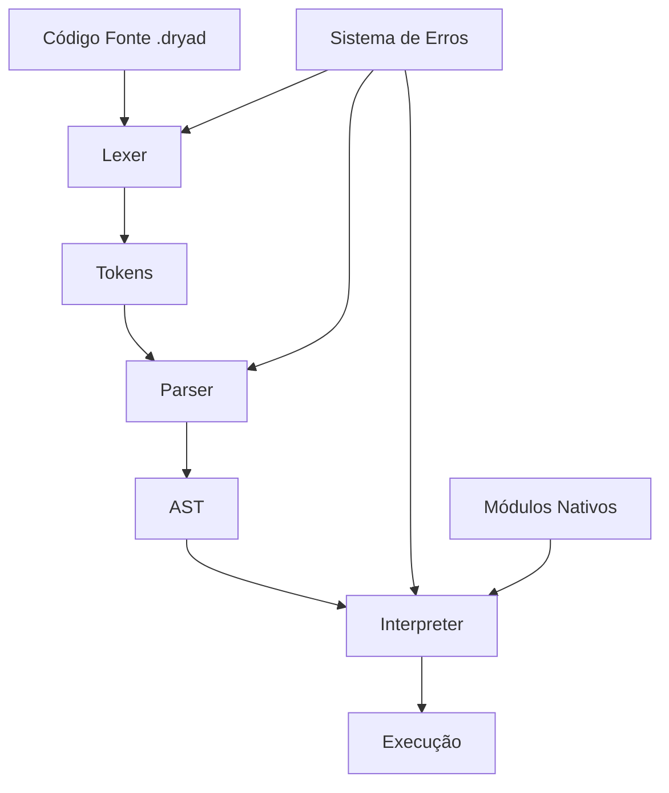

# Manual de Desenvolvimento - Linguagem Dryad

## 📋 Índice

1. [Visão Geral da Arquitetura](#-visão-geral-da-arquitetura)
2. [Pipeline de Compilação](#-pipeline-de-compilação)
3. [Sistema de Módulos (Crates)](#-sistema-de-módulos-crates)
4. [Lexer - Análise Léxica](#-lexer---análise-léxica)
5. [Parser - Análise Sintática](#-parser---análise-sintática)
6. [Runtime - Interpretador](#-runtime---interpretador)
7. [Sistema de Erros](#-sistema-de-erros)
8. [CLI - Interface de Linha de Comando](#-cli---interface-de-linha-de-comando)
9. [Oak - Gerenciador de Pacotes](#-oak---gerenciador-de-pacotes)
10. [Sistema de Módulos Nativos](#-sistema-de-módulos-nativos)
11. [Benchmarks e Testes](#-benchmarks-e-testes)
12. [Fluxo de Desenvolvimento](#-fluxo-de-desenvolvimento)
13. [Extensibilidade e Manutenção](#-extensibilidade-e-manutenção)

---

## 🏗 Visão Geral da Arquitetura

A linguagem Dryad é construída em Rust seguindo uma arquitetura modular baseada em crates. Cada componente tem responsabilidades bem definidas e interfaces claras entre si.

### Componentes Principais

```
┌─────────────────────────────────────────────────────────────┐
│                    LINGUAGEM DRYAD                         │
├─────────────────────────────────────────────────────────────┤
│  CLI Interface (dryad_cli)                                 │
├─────────────────────────────────────────────────────────────┤
│  Gerenciador de Pacotes (oak)                              │
├─────────────────────────────────────────────────────────────┤
│                    PIPELINE PRINCIPAL                      │
│  ┌─────────────┐  ┌─────────────┐  ┌─────────────┐         │
│  │    LEXER    │→ │   PARSER    │→ │   RUNTIME   │         │
│  │  (Tokens)   │  │    (AST)    │  │(Interpreter)│         │
│  └─────────────┘  └─────────────┘  └─────────────┘         │
├─────────────────────────────────────────────────────────────┤
│  Sistema de Erros (dryad_errors)                           │
├─────────────────────────────────────────────────────────────┤
│  Módulos Nativos & Benchmarks                              │
└─────────────────────────────────────────────────────────────┘
```

### Filosofia de Design

1. **Modularidade**: Cada crate tem uma responsabilidade única
2. **Test-Driven Development**: Testes abrangentes para cada funcionalidade
3. **Sistema de Erros Padronizado**: Códigos de erro categorizados
4. **Performance**: Interpretador otimizado com benchmarks constantes
5. **Extensibilidade**: Sistema de módulos nativos plugáveis

---

## 🔄 Pipeline de Compilação

O processo de execução de código Dryad segue este fluxo:



### 1. **Análise Léxica (Lexer)**
- Converte código fonte em tokens
- Identifica palavras-chave, operadores, literais
- Trata diretivas nativas (`#<module>`)

### 2. **Análise Sintática (Parser)**
- Constrói Árvore Sintática Abstrata (AST)
- Valida estrutura do código
- Identifica construções da linguagem

### 3. **Interpretação (Runtime)**
- Executa o AST
- Gerencia variáveis e escopo
- Chama módulos nativos

---

## 📦 Sistema de Módulos (Crates)

### Estrutura do Workspace

```
workspace/
├── Cargo.toml              # Workspace principal
├── crates/
│   ├── dryad_lexer/        # Análise léxica
│   ├── dryad_parser/       # Análise sintática  
│   ├── dryad_runtime/      # Interpretador
│   ├── dryad_errors/       # Sistema de erros
│   ├── dryad_cli/          # Interface CLI
│   ├── dryad_benchmark/    # Benchmarks
│   └── oak/                # Gerenciador de pacotes
```

### Dependências entre Crates

```rust
// Workspace dependencies (Cargo.toml)
[workspace.dependencies]
dryad_errors = { path = "crates/dryad_errors" }
dryad_lexer = { path = "crates/dryad_lexer" }
dryad_parser = { path = "crates/dryad_parser" }
dryad_runtime = { path = "crates/dryad_runtime" }
```

**Fluxo de Dependências:**
- `dryad_lexer` → `dryad_errors`
- `dryad_parser` → `dryad_lexer`, `dryad_errors`
- `dryad_runtime` → `dryad_parser`, `dryad_errors`
- `dryad_cli` → `dryad_runtime`, `dryad_lexer`, `dryad_parser`

---

## 🔤 Lexer - Análise Léxica

### Localização
- **Crate**: `crates/dryad_lexer/`
- **Arquivos principais**: `src/lexer.rs`, `src/token.rs`, `src/lib.rs`

### Estrutura de Tokens

```rust
// crates/dryad_lexer/src/token.rs
#[derive(Debug, Clone, PartialEq)]
pub enum Token {
    // Literais básicos
    Identifier(String),     // nomes de variáveis/funções
    Number(f64),           // números (todos são f64)
    String(String),        // strings entre aspas
    Boolean(bool),         // true/false
    Literal(String),       // null e literais especiais
    
    // Estruturas da linguagem
    Keyword(String),       // palavras-chave (if, for, class, etc)
    Operator(String),      // operadores (+, -, ==, etc)
    Arrow,                 // => para lambdas
    Symbol(char),          // símbolos únicos ({, }, etc)
    
    // Sistema de módulos
    NativeDirective(String), // #<module_name>
    
    // Controle
    Eof,                   // fim do arquivo
}
```

### Funcionalidades do Lexer

#### 1. **Tokenização Básica**
```rust
impl Lexer {
    pub fn new(source: &str) -> Self
    pub fn next_token(&mut self) -> Result<Token, DryadError>
    pub fn tokenize(&mut self) -> Result<Vec<Token>, DryadError>
}
```

#### 2. **Palavras-Chave Suportadas**
- **Controle de fluxo**: `if`, `else`, `while`, `do`, `for`, `foreach`, `break`, `continue`
- **Funções**: `function`, `async`, `thread`, `return`
- **Classes**: `class`, `extends`, `this`, `super`, `public`, `private`, `protected`, `static`
- **Exceções**: `try`, `catch`, `finally`, `throw`
- **Módulos**: `use`, `export`, `using`
- **Primitivos**: `let`, `var`, `true`, `false`, `null`, `const`
- **Threading**: `mutex`, `await`

#### 3. **Operadores**

**Aritméticos**: `+`, `-`, `*`, `/`, `%`, `**` (exponenciação)

**Comparação**: `==`, `!=`, `<`, `<=`, `>`, `>=`

**Lógicos**: `&&`, `||`, `!`

**Bitwise**: `&`, `|`, `^`, `~`, `<<`, `>>`

**Atribuição**: `=`, `+=`, `-=`, `*=`, `/=`, `%=`

**Incremento/Decremento**: `++`, `--`

**Bytes**: `&byte`, `|byte`, `^byte`

#### 4. **Diretivas Nativas**
```rust
// Reconhece diretivas como #<http_client>, #<file_io>
fn scan_native_directive(&mut self) -> Token {
    // Implementação em lexer.rs
}
```

### Tratamento de Erros no Lexer

```rust
// Erros específicos do lexer
pub enum LexerError {
    UnexpectedCharacter(char, usize),
    UnterminatedString(usize),
    InvalidNumber(String, usize),
    InvalidEscape(char, usize),
}
```

---

## 🌳 Parser - Análise Sintática

### Localização
- **Crate**: `crates/dryad_parser/`
- **Arquivos principais**: `src/parser.rs`, `src/ast.rs`, `src/lib.rs`

### Árvore Sintática Abstrata (AST)

#### Statements (Declarações)
```rust
// crates/dryad_parser/src/ast.rs
#[derive(Debug, Clone)]
pub enum Stmt {
    Expression(Expr),                    // expressões como statements
    VarDeclaration(String, Option<Expr>), // let x = valor
    Assignment(String, Expr),            // x = valor
    PropertyAssignment(Expr, String, Expr), // obj.prop = valor
    Block(Vec<Stmt>),                    // { stmt1; stmt2; }
    
    // Controle de fluxo
    If(Expr, Box<Stmt>),                 // if (condição) { }
    IfElse(Expr, Box<Stmt>, Box<Stmt>),  // if { } else { }
    While(Expr, Box<Stmt>),              // while (condição) { }
    DoWhile(Box<Stmt>, Expr),            // do { } while (condição)
    For(Option<Box<Stmt>>, Option<Expr>, Option<Box<Stmt>>, Box<Stmt>),
    ForEach(String, Expr, Box<Stmt>),    // for var in iterable { }
    Break,                               // break;
    Continue,                            // continue;
    
    // Exceções
    Try(Box<Stmt>, Option<(String, Box<Stmt>)>, Option<Box<Stmt>>), // try/catch/finally
    Throw(Expr),                         // throw expr;
    
    // Funções
    FunctionDeclaration(String, Vec<String>, Box<Stmt>),
    AsyncFunctionDeclaration(String, Vec<String>, Box<Stmt>),
    ThreadFunctionDeclaration(String, Vec<String>, Box<Stmt>),
    
    // Classes
    ClassDeclaration(String, Option<String>, Vec<ClassMember>),
    
    // Módulos
    Export(Box<Stmt>),                   // export statement
    Use(String),                         // use "module/path"
    Using(String),                       // using "module/path"
    
    Return(Option<Expr>),                // return [expr];
    NativeDirective(String),             // #<module>
}
```

#### Expressions (Expressões)
```rust
#[derive(Debug, Clone)]
pub enum Expr {
    Literal(Literal),                    // valores literais
    Binary(Box<Expr>, String, Box<Expr>), // operações binárias
    Unary(String, Box<Expr>),            // operações unárias
    Variable(String),                    // acesso a variáveis
    Call(Box<Expr>, Vec<Expr>),          // chamadas de função
    
    // Incremento/Decremento
    PostIncrement(Box<Expr>),            // x++
    PostDecrement(Box<Expr>),            // x--
    PreIncrement(Box<Expr>),             // ++x
    PreDecrement(Box<Expr>),             // --x
    
    // Estruturas de dados
    Array(Vec<Expr>),                    // [1, 2, 3]
    Tuple(Vec<Expr>),                    // (1, 2, 3)
    Index(Box<Expr>, Box<Expr>),         // array[index]
    TupleAccess(Box<Expr>, usize),       // tuple.0
    
    // Funções
    Lambda(Vec<String>, Box<Expr>),      // (x, y) => x + y
    
    // Classes
    This,                                // this
    Super,                               // super
    MethodCall(Box<Expr>, String, Vec<Expr>), // obj.method(args)
    PropertyAccess(Box<Expr>, String),   // obj.property
    ClassInstantiation(String, Vec<Expr>), // new Class(args)
    ObjectLiteral(Vec<ObjectProperty>),  // { key: value }
    
    // Threading/Async
    Await(Box<Expr>),                    // await expr
    ThreadCall(Box<Expr>, Vec<Expr>),    // thread(func, args)
    MutexCreation,                       // mutex()
}
```

### Parser Implementation

#### 1. **Recursive Descent Parser**
```rust
impl Parser {
    pub fn new(tokens: Vec<Token>) -> Self
    pub fn parse(&mut self) -> Result<Program, DryadError>
    
    // Métodos principais de parsing
    fn parse_statement(&mut self) -> Result<Stmt, DryadError>
    fn parse_expression(&mut self) -> Result<Expr, DryadError>
    fn parse_primary(&mut self) -> Result<Expr, DryadError>
}
```

#### 2. **Precedência de Operadores**
O parser implementa precedência correta para operadores:

1. **Primário**: literals, identifiers, parênteses
2. **Unário**: `!`, `-`, `++`, `--`
3. **Multiplicativo**: `*`, `/`, `%`
4. **Aditivo**: `+`, `-`
5. **Shift**: `<<`, `>>`
6. **Relacional**: `<`, `<=`, `>`, `>=`
7. **Igualdade**: `==`, `!=`
8. **Bitwise AND**: `&`
9. **Bitwise XOR**: `^`
10. **Bitwise OR**: `|`
11. **Lógico AND**: `&&`
12. **Lógico OR**: `||`
13. **Atribuição**: `=`, `+=`, `-=`, etc.

#### 3. **Parsing de Classes**
```rust
fn parse_class_declaration(&mut self) -> Result<Stmt, DryadError> {
    // class ClassName [extends ParentClass] {
    //     [visibility] [static] property: value;
    //     [visibility] [static] method(params) { body }
    // }
}
```

#### 4. **Parsing de Async/Thread Functions**
```rust
fn parse_async_function(&mut self) -> Result<Stmt, DryadError>
fn parse_thread_function(&mut self) -> Result<Stmt, DryadError>
```

---

## ⚡ Runtime - Interpretador

### Localização
- **Crate**: `crates/dryad_runtime/`
- **Arquivo principal**: `src/interpreter.rs`
- **Módulos nativos**: `src/native_modules/`

### Estrutura Principal

#### Value System
```rust
// Sistema de valores em runtime
#[derive(Debug, Clone)]
pub enum Value {
    // Tipos primitivos
    Number(f64),
    String(String),
    Bool(bool),
    Null,
    
    // Estruturas de dados
    Array(Vec<Value>),
    Tuple(Vec<Value>),
    
    // Controle de erro
    Exception(String),
    
    // Funções
    Function { name: String, params: Vec<String>, body: Stmt },
    AsyncFunction { name: String, params: Vec<String>, body: Stmt },
    ThreadFunction { name: String, params: Vec<String>, body: Stmt },
    Lambda { params: Vec<String>, body: Expr, closure: HashMap<String, Value> },
    
    // Threading
    Thread { id: u64, is_running: bool },
    Mutex { id: u64, locked: bool },
    Promise { id: u64, resolved: bool, value: Option<Box<Value>> },
    
    // Orientação a objetos
    Class { name: String, parent: Option<String>, methods: HashMap<String, ClassMethod>, properties: HashMap<String, ClassProperty> },
    Instance { class_name: String, properties: HashMap<String, Value> },
    Object { properties: HashMap<String, Value>, methods: HashMap<String, ObjectMethod> },
}
```

#### Interpreter Structure
```rust
pub struct Interpreter {
    // Gerenciamento de variáveis
    variables: HashMap<String, Value>,
    classes: HashMap<String, Value>,
    current_instance: Option<Value>,
    
    // Sistema de módulos
    native_modules: NativeModuleManager,
    imported_modules: HashMap<String, HashMap<String, Value>>,
    current_file_path: Option<PathBuf>,
    
    // Threading/Async
    next_thread_id: u64,
    next_mutex_id: u64,
    next_promise_id: u64,
    threads: HashMap<u64, std::thread::JoinHandle<Result<Value, DryadError>>>,
    mutexes: HashMap<u64, std::sync::Arc<std::sync::Mutex<()>>>,
    promises: HashMap<u64, tokio::task::JoinHandle<Result<Value, DryadError>>>,
}
```

### Funcionalidades do Runtime

#### 1. **Execução de Statements**
```rust
impl Interpreter {
    pub fn interpret(&mut self, program: Program) -> Result<(), DryadError>
    
    fn execute_stmt(&mut self, stmt: &Stmt) -> Result<Option<FlowControl>, DryadError> {
        match stmt {
            Stmt::VarDeclaration(name, value) => { /* implementação */ }
            Stmt::FunctionDeclaration(name, params, body) => { /* implementação */ }
            Stmt::If(condition, then_stmt) => { /* implementação */ }
            // ... outras implementações
        }
    }
}
```

#### 2. **Avaliação de Expressões**
```rust
fn evaluate_expr(&mut self, expr: &Expr) -> Result<Value, DryadError> {
    match expr {
        Expr::Literal(literal) => self.evaluate_literal(literal),
        Expr::Binary(left, op, right) => self.evaluate_binary(left, op, right),
        Expr::Call(callee, args) => self.evaluate_call(callee, args),
        // ... outras avaliações
    }
}
```

#### 3. **Sistema de Escopo**
O interpretador mantém um escopo de variáveis que permite:
- Declaração e acesso a variáveis
- Shadowing (variáveis locais ocultam globais)
- Resolução de nomes de função

#### 4. **Gerenciamento de Threading**
```rust
// Criação de threads
fn create_thread(&mut self, func: Value, args: Vec<Value>) -> Result<Value, DryadError>

// Criação de mutex
fn create_mutex(&mut self) -> Value

// Gerenciamento de promises para async
fn create_promise(&mut self, future: impl Future<Output = Result<Value, DryadError>>) -> Value
```

### Módulos Nativos

#### Sistema de Módulos
```rust
// src/native_modules/mod.rs
pub struct NativeModuleManager {
    modules: HashMap<String, Box<dyn NativeModule>>,
}

pub trait NativeModule {
    fn name(&self) -> &str;
    fn functions(&self) -> HashMap<String, NativeFunction>;
}
```

#### Módulos Disponíveis

1. **console_io**: `print()`, `println()`, `input()`
2. **file_io**: `read_file()`, `write_file()`, `delete_file()`
3. **http_client**: `get()`, `post()`, `put()`, `delete()`
4. **http_server**: `create_server()`, `listen()`
5. **crypto**: `hash()`, `encrypt()`, `decrypt()`
6. **time**: `now()`, `sleep()`, `format_time()`
7. **system_env**: `env()`, `set_env()`, `args()`
8. **utils**: `random()`, `uuid()`, `base64_encode()`

#### Implementação de Módulo Nativo
```rust
// Exemplo: console_io.rs
pub struct ConsoleIOModule;

impl NativeModule for ConsoleIOModule {
    fn name(&self) -> &str { "console_io" }
    
    fn functions(&self) -> HashMap<String, NativeFunction> {
        let mut funcs = HashMap::new();
        
        funcs.insert("print".to_string(), NativeFunction::new("print", |args| {
            if let Some(Value::String(s)) = args.first() {
                println!("{}", s);
                Ok(Value::Null)
            } else {
                Err(DryadError::runtime("print requer uma string"))
            }
        }));
        
        funcs
    }
}
```

---

## ❌ Sistema de Erros

### Localização
- **Crate**: `crates/dryad_errors/`
- **Arquivo principal**: `src/lib.rs`

### Estrutura de Erros

#### DryadError Principal
```rust
#[derive(Debug, Clone)]
pub struct DryadError {
    pub error_type: ErrorType,
    pub message: String,
    pub location: Option<SourceLocation>,
    pub stack_trace: Vec<StackFrame>,
    pub error_code: String,
    pub help_url: Option<String>,
}
```

#### Tipos de Erro
```rust
#[derive(Debug, Clone, PartialEq)]
pub enum ErrorType {
    // Erros de sintaxe
    LexerError,          // E001-E099
    ParserError,         // E100-E199
    
    // Erros de runtime
    RuntimeError,        // E200-E299
    TypeError,           // E300-E399
    ReferenceError,      // E400-E499
    
    // Erros de módulos
    ImportError,         // E500-E599
    NativeModuleError,   // E600-E699
    
    // Erros de sistema
    IOError,             // E700-E799
    NetworkError,        // E800-E899
    
    // Erros de threading
    ThreadingError,      // E900-E999
    AsyncError,          // E1000-E1099
}
```

#### Informações de Localização
```rust
#[derive(Debug, Clone, PartialEq, Eq)]
pub struct SourceLocation {
    pub file: Option<PathBuf>,    // arquivo onde ocorreu
    pub line: usize,              // linha (1-based)
    pub column: usize,            // coluna (1-based)
    pub position: usize,          // posição no arquivo
    pub source_line: Option<String>, // linha do código para contexto
}
```

#### Stack Trace
```rust
#[derive(Debug, Clone, PartialEq)]
pub struct StackFrame {
    pub function_name: String,
    pub location: SourceLocation,
}
```

### Sistema de Códigos de Erro

#### Categorização
- **E001-E099**: Erros léxicos (caracteres inválidos, strings não terminadas)
- **E100-E199**: Erros de sintaxe (estruturas malformadas)
- **E200-E299**: Erros de runtime (divisão por zero, null reference)
- **E300-E399**: Erros de tipo (operações inválidas entre tipos)
- **E400-E499**: Erros de referência (variável não declarada)
- **E500-E599**: Erros de importação (módulo não encontrado)

#### URLs de Ajuda
```rust
// src/error_urls.rs
pub fn get_error_help_url(error_code: &str) -> Option<String> {
    match error_code {
        "E001" => Some("https://dryad-lang.org/errors/lexer/unexpected-character".to_string()),
        "E100" => Some("https://dryad-lang.org/errors/parser/syntax-error".to_string()),
        // ...
    }
}
```

### Criação de Erros

#### Factory Methods
```rust
impl DryadError {
    // Erros específicos
    pub fn lexer_error(message: &str, location: SourceLocation) -> Self
    pub fn parser_error(message: &str, location: SourceLocation) -> Self
    pub fn runtime_error(message: &str) -> Self
    pub fn type_error(expected: &str, found: &str) -> Self
    pub fn reference_error(name: &str) -> Self
    
    // Erros com contexto
    pub fn with_location(mut self, location: SourceLocation) -> Self
    pub fn with_stack_trace(mut self, frames: Vec<StackFrame>) -> Self
    pub fn with_help_url(mut self, url: String) -> Self
}
```

---

## 💻 CLI - Interface de Linha de Comando

### Localização
- **Crate**: `crates/dryad_cli/`
- **Arquivo principal**: `src/main.rs`

### Comandos Disponíveis

```rust
#[derive(Subcommand)]
enum Commands {
    /// Executa um arquivo Dryad
    Run {
        file: String,
        #[arg(short, long)]
        verbose: bool,
    },
    
    /// Inicia o modo interativo (REPL)
    Repl,
    
    /// Valida a sintaxe sem executar
    Check {
        file: String,
    },
    
    /// Mostra tokens (debug)
    Tokens {
        file: String,
    },
    
    /// Informações da versão
    Version,
}
```

### Implementação dos Comandos

#### 1. **Comando Run**
```rust
fn run_file(filename: &str, verbose: bool) -> Result<(), Box<dyn std::error::Error>> {
    // 1. Lê arquivo fonte
    let source = fs::read_to_string(filename)?;
    
    // 2. Pipeline completo
    let mut lexer = Lexer::new(&source);
    let tokens = lexer.tokenize()?;
    
    let mut parser = DryadParser::new(tokens);
    let program = parser.parse()?;
    
    let mut interpreter = Interpreter::new();
    interpreter.interpret(program)?;
    
    Ok(())
}
```

#### 2. **REPL (Read-Eval-Print Loop)**
```rust
fn run_repl() -> Result<(), Box<dyn std::error::Error>> {
    println!("🌿 Dryad REPL v{}", env!("CARGO_PKG_VERSION"));
    
    let mut interpreter = Interpreter::new();
    let stdin = io::stdin();
    
    loop {
        print!("dryad> ");
        io::stdout().flush()?;
        
        let mut input = String::new();
        stdin.read_line(&mut input)?;
        
        if input.trim() == "exit" || input.trim() == "quit" {
            break;
        }
        
        // Executa input como código Dryad
        match execute_line(&mut interpreter, &input) {
            Ok(value) => {
                if value != Value::Null {
                    println!("=> {:?}", value);
                }
            }
            Err(e) => println!("Erro: {}", e),
        }
    }
    
    Ok(())
}
```

#### 3. **Comando Check**
```rust
fn check_file(filename: &str) -> Result<(), Box<dyn std::error::Error>> {
    let source = fs::read_to_string(filename)?;
    
    // Apenas lexer + parser (sem executar)
    let mut lexer = Lexer::new(&source);
    let tokens = lexer.tokenize()?;
    
    let mut parser = DryadParser::new(tokens);
    let _program = parser.parse()?;
    
    println!("✓ Sintaxe válida");
    Ok(())
}
```

#### 4. **Comando Tokens (Debug)**
```rust
fn show_tokens(filename: &str) -> Result<(), Box<dyn std::error::Error>> {
    let source = fs::read_to_string(filename)?;
    let mut lexer = Lexer::new(&source);
    
    println!("=== TOKENS ===");
    loop {
        let token = lexer.next_token()?;
        println!("{:?}", token);
        if token == Token::Eof {
            break;
        }
    }
    
    Ok(())
}
```

### Tratamento de Erros no CLI

```rust
// Formatting de erros para usuário final
fn format_error_for_user(error: &DryadError) -> String {
    let mut output = String::new();
    
    // Cabeçalho do erro
    output.push_str(&format!("❌ Erro {}: {}\n", error.error_code, error.message));
    
    // Localização se disponível
    if let Some(location) = &error.location {
        output.push_str(&format!("   em {}:{}:{}\n", 
            location.file.as_ref().map(|p| p.display().to_string()).unwrap_or("desconhecido".to_string()),
            location.line,
            location.column
        ));
        
        // Linha do código se disponível
        if let Some(source_line) = &location.source_line {
            output.push_str(&format!("   | {}\n", source_line));
            output.push_str(&format!("   | {}^\n", " ".repeat(location.column.saturating_sub(1))));
        }
    }
    
    // Stack trace
    if !error.stack_trace.is_empty() {
        output.push_str("   Stack trace:\n");
        for frame in &error.stack_trace {
            output.push_str(&format!("     em {}\n", frame.function_name));
        }
    }
    
    // URL de ajuda
    if let Some(url) = &error.help_url {
        output.push_str(&format!("   Ajuda: {}\n", url));
    }
    
    output
}
```

---

## 🌰 Oak - Gerenciador de Pacotes

### Localização
- **Crate**: `crates/oak/`
- **Arquivo principal**: `src/main.rs`

### Estrutura do Oak

#### Arquivo de Configuração (oak.toml)
```toml
[package]
name = "meu_projeto"
version = "1.0.0"
description = "Minha aplicação Dryad"
author = "Desenvolvedor"
license = "MIT"
type = "project"  # ou "library"
main = "src/main.dryad"

[dependencies]
http_utils = "1.0.0"
json_parser = "2.1.0"

[dev_dependencies]  
test_framework = "1.5.0"

[scripts]
start = "dryad src/main.dryad"
test = "dryad test/all_tests.dryad"
build = "dryad build/compile.dryad"
```

#### Lock File (oaklock.json)
```json
{
  "modules": {
    "http_utils": {
      "paths": {
        "http_client": "modules/http_utils/client.dryad",
        "http_server": "modules/http_utils/server.dryad"
      }
    },
    "json_parser": {
      "paths": {
        "parser": "modules/json_parser/main.dryad",
        "validator": "modules/json_parser/validator.dryad"
      }
    }
  }
}
```

### Comandos do Oak

#### 1. **oak init** - Criação de Projeto
```rust
fn init_project(name: String, path: Option<String>, project_type: String) -> Result<(), Box<dyn std::error::Error>> {
    let project_path = path.unwrap_or_else(|| format!("./{}", name));
    
    // Cria estrutura de diretórios
    fs::create_dir_all(&project_path)?;
    fs::create_dir_all(format!("{}/src", project_path))?;
    
    // Cria oak.toml
    let config = OakConfig {
        name: name.clone(),
        version: "1.0.0".to_string(),
        project_type: match project_type.as_str() {
            "library" => ProjectType::Library,
            _ => ProjectType::Project,
        },
        main: Some("src/main.dryad".to_string()),
        ..Default::default()
    };
    
    let toml_content = toml::to_string(&config)?;
    fs::write(format!("{}/oak.toml", project_path), toml_content)?;
    
    // Cria arquivo principal
    let main_content = match project_type.as_str() {
        "library" => r#"// Biblioteca Dryad
export function hello() {
    return "Hello from library!";
}
"#,
        _ => r#"// Aplicação Dryad
print("Hello, Dryad!");
"#,
    };
    
    fs::write(format!("{}/src/main.dryad", project_path), main_content)?;
    
    println!("✅ Projeto '{}' criado em {}", name, project_path);
    Ok(())
}
```

#### 2. **oak install** - Instalação de Dependências
```rust
fn install_package(package: Option<String>, version: Option<String>) -> Result<(), Box<dyn std::error::Error>> {
    // Carrega oak.toml
    let mut config = load_config()?;
    
    match package {
        Some(pkg_name) => {
            // Instalar pacote específico
            let pkg_version = version.unwrap_or("latest".to_string());
            config.dependencies.insert(pkg_name.clone(), pkg_version);
            save_config(&config)?;
            
            // Baixar e instalar pacote
            download_package(&pkg_name, &config.dependencies[&pkg_name])?;
            println!("✅ Pacote '{}' instalado", pkg_name);
        }
        None => {
            // Instalar todas as dependências
            for (pkg_name, version) in &config.dependencies {
                download_package(pkg_name, version)?;
            }
            println!("✅ Todas as dependências instaladas");
        }
    }
    
    // Atualizar oaklock.json
    update_lock_file(&config)?;
    Ok(())
}
```

#### 3. **oak run** - Execução de Scripts
```rust
fn run_script(script_name: String) -> Result<(), Box<dyn std::error::Error>> {
    let config = load_config()?;
    
    if let Some(command) = config.scripts.get(&script_name) {
        println!("🏃 Executando script: {}", script_name);
        
        let mut cmd = std::process::Command::new("sh");
        cmd.arg("-c").arg(command);
        
        let status = cmd.status()?;
        if !status.success() {
            return Err(format!("Script '{}' falhou", script_name).into());
        }
        
        println!("✅ Script '{}' executado com sucesso", script_name);
    } else {
        return Err(format!("Script '{}' não encontrado", script_name).into());
    }
    
    Ok(())
}
```

### Sistema de Módulos

#### Resolução de Imports
```rust
// Resolução de caminhos de módulos
fn resolve_module_path(module_name: &str, current_file: &Path) -> Result<PathBuf, DryadError> {
    // 1. Verifica se é módulo relativo
    if module_name.starts_with("./") || module_name.starts_with("../") {
        let path = current_file.parent().unwrap().join(module_name);
        if path.exists() {
            return Ok(path);
        }
    }
    
    // 2. Verifica em node_modules/oak_modules
    let oak_modules = current_file.parent().unwrap().join("oak_modules").join(module_name);
    if oak_modules.exists() {
        return Ok(oak_modules);
    }
    
    // 3. Verifica dependências globais
    // ...
    
    Err(DryadError::import_error(&format!("Módulo '{}' não encontrado", module_name)))
}
```

---

## 🔧 Sistema de Módulos Nativos

### Estrutura
- **Localização**: `crates/dryad_runtime/src/native_modules/`
- **Gerenciador**: `mod.rs`
- **Módulos individuais**: cada módulo em arquivo separado

### Interface de Módulo Nativo

```rust
// Trait para módulos nativos
pub trait NativeModule: Send + Sync {
    fn name(&self) -> &str;
    fn functions(&self) -> HashMap<String, NativeFunction>;
    fn initialize(&mut self) -> Result<(), DryadError> { Ok(()) }
    fn cleanup(&mut self) -> Result<(), DryadError> { Ok(()) }
}

// Wrapper para função nativa
pub struct NativeFunction {
    pub name: String,
    pub function: fn(&[Value]) -> Result<Value, DryadError>,
    pub min_args: usize,
    pub max_args: Option<usize>,
}
```

### Módulos Implementados

#### 1. **Console I/O** (`console_io.rs`)
```rust
impl NativeModule for ConsoleIOModule {
    fn functions(&self) -> HashMap<String, NativeFunction> {
        let mut funcs = HashMap::new();
        
        // print(message: string) -> null
        funcs.insert("print".to_string(), NativeFunction {
            name: "print".to_string(),
            function: |args| {
                if let Some(Value::String(s)) = args.first() {
                    print!("{}", s);
                    Ok(Value::Null)
                } else {
                    Err(DryadError::runtime_error("print() requer uma string"))
                }
            },
            min_args: 1,
            max_args: Some(1),
        });
        
        // input(prompt?: string) -> string
        funcs.insert("input".to_string(), NativeFunction {
            name: "input".to_string(),
            function: |args| {
                if let Some(Value::String(prompt)) = args.first() {
                    print!("{}", prompt);
                }
                io::stdout().flush().unwrap();
                
                let mut input = String::new();
                io::stdin().read_line(&mut input).unwrap();
                Ok(Value::String(input.trim().to_string()))
            },
            min_args: 0,
            max_args: Some(1),
        });
        
        funcs
    }
}
```

#### 2. **File I/O** (`file_io.rs`)
```rust
impl NativeModule for FileIOModule {
    fn functions(&self) -> HashMap<String, NativeFunction> {
        let mut funcs = HashMap::new();
        
        // read_file(path: string) -> string
        funcs.insert("read_file".to_string(), NativeFunction {
            name: "read_file".to_string(),
            function: |args| {
                if let Some(Value::String(path)) = args.first() {
                    match fs::read_to_string(path) {
                        Ok(content) => Ok(Value::String(content)),
                        Err(e) => Err(DryadError::io_error(&format!("Erro ao ler arquivo: {}", e))),
                    }
                } else {
                    Err(DryadError::runtime_error("read_file() requer um caminho"))
                }
            },
            min_args: 1,
            max_args: Some(1),
        });
        
        // write_file(path: string, content: string) -> bool
        funcs.insert("write_file".to_string(), NativeFunction {
            name: "write_file".to_string(),
            function: |args| {
                if args.len() < 2 {
                    return Err(DryadError::runtime_error("write_file() requer caminho e conteúdo"));
                }
                
                if let (Value::String(path), Value::String(content)) = (&args[0], &args[1]) {
                    match fs::write(path, content) {
                        Ok(_) => Ok(Value::Bool(true)),
                        Err(e) => Err(DryadError::io_error(&format!("Erro ao escrever arquivo: {}", e))),
                    }
                } else {
                    Err(DryadError::runtime_error("write_file() requer strings"))
                }
            },
            min_args: 2,
            max_args: Some(2),
        });
        
        funcs
    }
}
```

#### 3. **HTTP Client** (`http_client.rs`)
```rust
impl NativeModule for HttpClientModule {
    fn functions(&self) -> HashMap<String, NativeFunction> {
        let mut funcs = HashMap::new();
        
        // get(url: string, headers?: object) -> object
        funcs.insert("get".to_string(), NativeFunction {
            name: "get".to_string(),
            function: |args| {
                if let Some(Value::String(url)) = args.first() {
                    // Implementação da requisição HTTP GET
                    let response = reqwest::blocking::get(url)
                        .map_err(|e| DryadError::network_error(&e.to_string()))?;
                    
                    let status = response.status().as_u16();
                    let text = response.text()
                        .map_err(|e| DryadError::network_error(&e.to_string()))?;
                    
                    // Retorna objeto com status e body
                    let mut result = HashMap::new();
                    result.insert("status".to_string(), Value::Number(status as f64));
                    result.insert("body".to_string(), Value::String(text));
                    
                    Ok(Value::Object {
                        properties: result,
                        methods: HashMap::new(),
                    })
                } else {
                    Err(DryadError::runtime_error("get() requer uma URL"))
                }
            },
            min_args: 1,
            max_args: Some(2),
        });
        
        funcs
    }
}
```

### Registro e Ativação de Módulos

```rust
// Gerenciador principal
pub struct NativeModuleManager {
    modules: HashMap<String, Box<dyn NativeModule>>,
    active_modules: HashSet<String>,
}

impl NativeModuleManager {
    pub fn new() -> Self {
        let mut manager = Self {
            modules: HashMap::new(),
            active_modules: HashSet::new(),
        };
        
        // Registra módulos padrão
        manager.register_module(Box::new(ConsoleIOModule));
        manager.register_module(Box::new(FileIOModule));
        manager.register_module(Box::new(HttpClientModule));
        manager.register_module(Box::new(HttpServerModule));
        manager.register_module(Box::new(CryptoModule));
        manager.register_module(Box::new(TimeModule));
        manager.register_module(Box::new(SystemEnvModule));
        manager.register_module(Box::new(UtilsModule));
        
        manager
    }
    
    pub fn activate_module(&mut self, module_name: &str) -> Result<(), DryadError> {
        if self.modules.contains_key(module_name) {
            self.active_modules.insert(module_name.to_string());
            Ok(())
        } else {
            Err(DryadError::native_module_error(&format!("Módulo '{}' não encontrado", module_name)))
        }
    }
    
    pub fn call_function(&self, module_name: &str, function_name: &str, args: &[Value]) -> Result<Value, DryadError> {
        if !self.active_modules.contains(module_name) {
            return Err(DryadError::native_module_error(&format!("Módulo '{}' não está ativo", module_name)));
        }
        
        let module = self.modules.get(module_name).unwrap();
        let functions = module.functions();
        
        if let Some(function) = functions.get(function_name) {
            // Validar argumentos
            if args.len() < function.min_args {
                return Err(DryadError::runtime_error(&format!(
                    "{}() requer pelo menos {} argumentos", 
                    function_name, function.min_args
                )));
            }
            
            if let Some(max_args) = function.max_args {
                if args.len() > max_args {
                    return Err(DryadError::runtime_error(&format!(
                        "{}() aceita no máximo {} argumentos", 
                        function_name, max_args
                    )));
                }
            }
            
            (function.function)(args)
        } else {
            Err(DryadError::runtime_error(&format!("Função '{}' não encontrada no módulo '{}'", function_name, module_name)))
        }
    }
}
```

---

## 🚀 Benchmarks e Testes

### Localização
- **Crate**: `crates/dryad_benchmark/`
- **Diretório de testes**: cada crate tem seu próprio `tests/`

### Sistema de Benchmarks

#### Estrutura
```rust
// crates/dryad_benchmark/src/lib.rs
pub struct BenchmarkSuite {
    pub name: String,
    pub benchmarks: Vec<Benchmark>,
}

pub struct Benchmark {
    pub name: String,
    pub source_code: String,
    pub expected_result: Option<Value>,
    pub max_duration: Option<Duration>,
}
```

#### Benchmarks Implementados

1. **Lexer Benchmarks** (`benches/lexer_bench.rs`)
```rust
#[bench]
fn bench_tokenize_large_file(b: &mut Bencher) {
    let source = fs::read_to_string("test_files/large_program.dryad").unwrap();
    
    b.iter(|| {
        let mut lexer = Lexer::new(&source);
        lexer.tokenize().unwrap()
    });
}
```

2. **Parser Benchmarks** (`benches/parser_bench.rs`)
```rust
#[bench]
fn bench_parse_complex_ast(b: &mut Bencher) {
    let tokens = load_complex_tokens();
    
    b.iter(|| {
        let mut parser = DryadParser::new(tokens.clone());
        parser.parse().unwrap()
    });
}
```

3. **Runtime Benchmarks** (`benches/runtime_bench.rs`)
```rust
#[bench]
fn bench_function_calls(b: &mut Bencher) {
    let program = parse_program("function test() { return 42; } test();");
    
    b.iter(|| {
        let mut interpreter = Interpreter::new();
        interpreter.interpret(program.clone()).unwrap()
    });
}
```

#### End-to-End Benchmarks
```rust
// benches/end_to_end_bench.rs
#[bench]
fn bench_complete_pipeline(b: &mut Bencher) {
    let source_code = r#"
        function fibonacci(n) {
            if (n <= 1) return n;
            return fibonacci(n - 1) + fibonacci(n - 2);
        }
        fibonacci(20);
    "#;
    
    b.iter(|| {
        // Pipeline completo: Lexer -> Parser -> Runtime
        let mut lexer = Lexer::new(source_code);
        let tokens = lexer.tokenize().unwrap();
        
        let mut parser = DryadParser::new(tokens);
        let program = parser.parse().unwrap();
        
        let mut interpreter = Interpreter::new();
        interpreter.interpret(program).unwrap()
    });
}
```

### Sistema de Testes

#### Testes Unitários
Cada crate tem seus próprios testes unitários:

**Lexer Tests** (`dryad_lexer/tests/`)
- `lexer_tests.rs`: testes básicos de tokenização
- `control_flow_tests.rs`: tokens de controle de fluxo
- `function_keywords_tests.rs`: palavras-chave de funções
- `async_threading_tests.rs`: tokens de async/threading

**Parser Tests** (`dryad_parser/tests/`)
- `parser_tests.rs`: parsing básico
- `function_parser_tests.rs`: declarações de função
- `class_parser_tests.rs`: classes e herança
- `async_threading_parser_tests.rs`: async/threading

**Runtime Tests** (`dryad_runtime/tests/`)
- `interpreter_tests.rs`: interpretação básica
- `function_runtime_tests.rs`: execução de funções
- `class_tests.rs`: orientação a objetos
- `async_threading_runtime_tests.rs`: concorrência

#### Testes de Integração
```rust
// crates/tests/integration_function_complete.rs
#[test]
fn test_complete_function_pipeline() {
    let source = r#"
        function add(a, b) {
            return a + b;
        }
        
        let result = add(5, 3);
        print(result);
    "#;
    
    // Testa pipeline completo
    let mut lexer = Lexer::new(source);
    let tokens = lexer.tokenize().unwrap();
    
    let mut parser = DryadParser::new(tokens);
    let program = parser.parse().unwrap();
    
    let mut interpreter = Interpreter::new();
    interpreter.interpret(program).unwrap();
    
    // Verifica resultado
    assert_eq!(interpreter.get_variable("result").unwrap(), Value::Number(8.0));
}
```

#### Execução de Testes
```bash
# Testes unitários
cargo test

# Testes específicos de um crate
cargo test -p dryad_lexer

# Benchmarks
cargo bench

# Testes com output detalhado
cargo test -- --nocapture
```

---

## 🔄 Fluxo de Desenvolvimento

### Estrutura de Desenvolvimento

#### 1. **Test-Driven Development (TDD)**
```
1. Escrever teste que falha
2. Implementar funcionalidade mínima
3. Fazer teste passar
4. Refatorar
5. Repetir
```

#### 2. **Pipeline de CI/CD**
```yaml
# .github/workflows/rust.yml
name: Rust CI

on: [push, pull_request]

jobs:
  test:
    runs-on: ubuntu-latest
    steps:
    - uses: actions/checkout@v2
    - uses: actions-rs/toolchain@v1
      with:
        toolchain: stable
    
    # Testes
    - name: Run tests
      run: cargo test --all
    
    # Benchmarks
    - name: Run benchmarks
      run: cargo bench
    
    # Lint
    - name: Check format
      run: cargo fmt -- --check
    
    - name: Clippy
      run: cargo clippy -- -D warnings
```

#### 3. **Adição de Nova Funcionalidade**

**Exemplo: Adicionar novo operador**

1. **Lexer**: Adicionar token no `token.rs`
```rust
// Em Token enum
BitwiseLeftShift, // <<
```

2. **Lexer**: Implementar reconhecimento
```rust
// Em lexer.rs scan_operator()
"<<" => Token::Operator("<<".to_string()),
```

3. **Parser**: Adicionar na precedência
```rust
// Em parser.rs parse_binary()
"<<" => Ok(Expr::Binary(left, "<<".to_string(), right)),
```

4. **Runtime**: Implementar execução
```rust
// Em interpreter.rs evaluate_binary()
"<<" => {
    let left_num = self.as_number(left)?;
    let right_num = self.as_number(right)?;
    Ok(Value::Number(((left_num as i64) << (right_num as i64)) as f64))
}
```

5. **Testes**: Adicionar cobertura completa
```rust
#[test]
fn test_bitwise_left_shift() {
    let source = "let result = 4 << 2;"; // deveria ser 16
    // ... teste completo
}
```

### Estrutura de Commits

#### Convenção de Commits
```
feat: adiciona operador bitwise left shift
fix: corrige parsing de strings com escape
docs: atualiza documentação do sistema de erros  
test: adiciona testes para classes
refactor: melhora performance do lexer
chore: atualiza dependências
```

#### Branches
- `main`: código estável, sempre funcional
- `develop`: desenvolvimento ativo
- `feature/nome-funcionalidade`: novas funcionalidades
- `fix/nome-bug`: correções
- `docs/nome-documentacao`: documentação

---

## 🔧 Extensibilidade e Manutenção

### Adicionar Novo Módulo Nativo

#### 1. Criar o módulo
```rust
// src/native_modules/meu_modulo.rs
use super::*;

pub struct MeuModulo;

impl NativeModule for MeuModulo {
    fn name(&self) -> &str {
        "meu_modulo"
    }
    
    fn functions(&self) -> HashMap<String, NativeFunction> {
        let mut funcs = HashMap::new();
        
        funcs.insert("minha_funcao".to_string(), NativeFunction {
            name: "minha_funcao".to_string(),
            function: |args| {
                // Implementar funcionalidade
                Ok(Value::String("resultado".to_string()))
            },
            min_args: 0,
            max_args: Some(1),
        });
        
        funcs
    }
}
```

#### 2. Registrar no gerenciador
```rust
// src/native_modules/mod.rs
pub mod meu_modulo;
pub use meu_modulo::MeuModulo;

// No NativeModuleManager::new()
manager.register_module(Box::new(MeuModulo));
```

#### 3. Adicionar testes
```rust
// tests/meu_modulo_tests.rs
#[test]
fn test_minha_funcao() {
    let source = r#"
        #<meu_modulo>
        let resultado = minha_funcao();
    "#;
    
    // Teste completo...
}
```

### Expandir Sintaxe da Linguagem

#### 1. Adicionar Palavras-chave
```rust
// Em lexer.rs, is_keyword()
"nova_keyword" => true,
```

#### 2. Expandir AST
```rust
// Em ast.rs
pub enum Stmt {
    // ... existentes
    NovaEstrutura(Expr, Vec<Stmt>),
}
```

#### 3. Implementar Parsing
```rust
// Em parser.rs
fn parse_nova_estrutura(&mut self) -> Result<Stmt, DryadError> {
    // Implementação do parsing
}
```

#### 4. Implementar Execução
```rust
// Em interpreter.rs
Stmt::NovaEstrutura(expr, stmts) => {
    // Implementação da execução
}
```

### Melhorar Performance

#### 1. Profiling
```rust
// Usar ferramentas como:
// - cargo flamegraph
// - perf
// - criterion para benchmarks
```

#### 2. Otimizações Comuns
- Cache de tokens frequentes no lexer
- Pool de objetos no runtime
- Lazy evaluation onde possível
- Otimização de estruturas de dados

#### 3. Monitoramento
- Benchmarks automáticos no CI
- Métricas de performance
- Comparação com versões anteriores

### Debugging e Diagnóstico

#### 1. Logs de Debug
```rust
// Usar log crate em desenvolvimento
use log::{debug, info, warn, error};

debug!("Tokenizing: {:?}", current_char);
info!("Parsed {} statements", statements.len());
warn!("Performance degradation detected");
error!("Critical error in interpreter");
```

#### 2. Ferramentas de Debug
```rust
// Comando especial para debugging
dryad debug arquivo.dryad
```

#### 3. Instrumentação
```rust
// Adicionar métricas internas
pub struct InterpreterMetrics {
    pub statements_executed: u64,
    pub functions_called: u64,
    pub memory_allocated: u64,
}
```

---

## 📚 Recursos de Referência

### Documentação de APIs

#### Principais Estruturas
- `Token`: Representa tokens léxicos
- `Stmt` e `Expr`: Nós da AST
- `Value`: Valores em runtime
- `DryadError`: Sistema de erros
- `Interpreter`: Motor de execução

#### Interfaces Públicas
- `Lexer::tokenize()`: Análise léxica
- `Parser::parse()`: Análise sintática
- `Interpreter::interpret()`: Execução
- `NativeModule` trait: Extensão nativa

### Exemplos de Código

#### Programa Completo Dryad
```dryad
#<http_client>
#<file_io>

class HTTPService {
    private url;
    
    constructor(baseUrl) {
        this.url = baseUrl;
    }
    
    async fetchData(endpoint) {
        let fullUrl = this.url + endpoint;
        let response = await get(fullUrl);
        return response;
    }
}

async function main() {
    let service = HTTPService("https://api.exemplo.com");
    
    try {
        let data = await service.fetchData("/users");
        write_file("users.json", data.body);
        print("Dados salvos com sucesso!");
    } catch (e) {
        print("Erro: " + e);
    }
}

main();
```

### Guias de Contribuição

#### Adicionando Testes
1. Identifique a funcionalidade
2. Crie teste que falha
3. Implemente funcionalidade
4. Verifique se teste passa
5. Adicione casos edge

#### Reportando Bugs
1. Use sistema de issues do GitHub
2. Inclua código de reprodução
3. Especifique versão do Dryad
4. Descreva comportamento esperado vs atual

#### Submetendo PRs
1. Fork do repositório
2. Branch específica para mudança
3. Testes para nova funcionalidade
4. Documentação atualizada
5. PR com descrição clara

---

Este manual fornece uma visão completa da arquitetura interna da linguagem Dryad, servindo como guia definitivo para manutenção, desenvolvimento de funcionalidades e extensão do sistema. Cada seção detalha tanto a implementação atual quanto as melhores práticas para futuras modificações.
